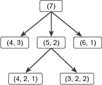

# Optimisation

## Contents

1. [Introduction](#Introduction)
2. [Search and problem space](#Search-and-problem-space)

## Introduction

Optimisation is a form of search – seeking the best solution among the multitude of possible solutions, for instance take the Travelling salesman problem (TSP). The optimisation task with TSP is to find the order in which to visit all _N_ cities once (and only once), and return to the start, that will give the shortest round trip – known as a **tour**. At first it’s a simple matter of brute-force search – just try every ordering and pick the best one? But this approach very rapidly becomes impractical. Knowing that the number of possible orderings of a set of _N_ items is n! If there were five cities, so for a given starting point there are 4! = 24 possible ways to order this basic set. This grows increasingly more difficult the more cities need to be visted, for 10 cities, there are 9! = 362,880 tours; for 20 cities the number of tours is 19! = 1.22 × 1017(approximately); for 75 cities, the number of tours is an unimaginably huge 3.31 × 10107. Wing design is clearly another problem in optimisation, as the designer is seeking the best (highest) possible lift and the best (lowest) possible drag, as well as the best possible values of other features. The crucial difference from the TSP, however, is this: the TSP requires that only one value (the length of the tour) be optimised, whereas the wing design problem requires the simultaneous optimisation of several. TSP si a **single-objective** problem and wing design **multi-objective**.

## Search and problem space

A set of possible solutions is often reffered to as a problem space. It's possible to think of the problem space for any optimisation problem as a simple list of alternatives. For example, the problem space for a 75-city TSP could be seen as a list of all the possible tours – a list with 3.31 × 10107 elements. However, a much better idea is to transform an optimisation problem into a different computational problem, by giving the problem space a structure.

A simple optimisation problem is [Grundy's Game](https://en.wikipedia.org/wiki/Grundy%27s_game) and it's structure reflects two ideas: **choice and consequence**. A player chooses to make a certain move, and this choice will have the consequence of limiting the moves the other player will be able to make next.

The possiblem moves can be mapped as a tree:

Each node in the tree represents a possible **game state** – an arrangement of the coins after a certain move has been made. Each edge depicts a possible move. From the start position, Bob has three options within the rules of the game, each of which results in a different game state. A couple of Alice’s possible responses to Bob’s splitting the starting stack into a stack of 5 and a stack of 2. Each level in the tree represents the complete set of possible moves that one of the players can make at a certain stage in the game.

It's also possible to show the nodes by using sequences:

