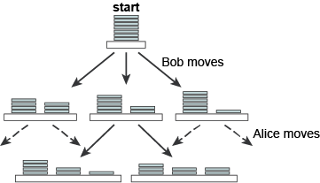

# Optimisation

## Contents

1. [Introduction](#Introduction)
2. [Search and problem space](#Search-and-problem-space)  
    2a. [Back to trees](#back-to-trees)  
    2b. [Implicit Trees](#Implicit-Trees)  
    2c. [Searching Trees](#Searching-Trees)

## Introduction

Optimisation is a form of search – seeking the best solution among the multitude of possible solutions, for instance take the Travelling salesman problem (TSP). The optimisation task with TSP is to find the order in which to visit all _N_ cities once (and only once), and return to the start, that will give the shortest round trip – known as a **tour**. At first it’s a simple matter of brute-force search – just try every ordering and pick the best one? But this approach very rapidly becomes impractical. Knowing that the number of possible orderings of a set of _N_ items is n! If there were five cities, so for a given starting point there are 4! = 24 possible ways to order this basic set. This grows increasingly more difficult the more cities need to be visted, for 10 cities, there are 9! = 362,880 tours; for 20 cities the number of tours is 19! = 1.22 × 10<sup>17</sup>(approximately); for 75 cities, the number of tours is an unimaginably huge 3.31 × 10<sup>107</sup>. Wing design is clearly another problem in optimisation, as the designer is seeking the best (highest) possible lift and the best (lowest) possible drag, as well as the best possible values of other features. The crucial difference from the TSP, however, is this: the TSP requires that only one value (the length of the tour) be optimised, whereas the wing design problem requires the simultaneous optimisation of several. TSP si a **single-objective** problem and wing design **multi-objective**.

## Search and problem space

A set of possible solutions is often reffered to as a problem space. It's possible to think of the problem space for any optimisation problem as a simple list of alternatives. For example, the problem space for a 75-city TSP could be seen as a list of all the possible tours – a list with 3.31 × 10<sup>107</sup> elements. However, a much better idea is to transform an optimisation problem into a different computational problem, by giving the problem space a structure.

A simple optimisation problem is [Grundy's Game](https://en.wikipedia.org/wiki/Grundy%27s_game) and it's structure reflects two ideas: **choice and consequence**. A player chooses to make a certain move, and this choice will have the consequence of limiting the moves the other player will be able to make next.

The possiblem moves can be mapped as a tree:



Each node in the tree represents a possible **game state** – an arrangement of the coins after a certain move has been made. Each edge depicts a possible move. From the start position, Bob has three options within the rules of the game, each of which results in a different game state. A couple of Alice’s possible responses to Bob’s splitting the starting stack into a stack of 5 and a stack of 2. Each level in the tree represents the complete set of possible moves that one of the players can make at a certain stage in the game.

It's also possible to show the nodes by using sequences:


The game proceeds in simple deterministic fashion – Bob makes a move, leaving Alice with various options (or, in the end, no legal options), and so on. This is the structure of the problem space, but there is no guidance as to what is a good move or a bad move. So the computer needs know what is the best move.

### Back to trees

Trees representing the problem spaces of problems above are not binary trees, but general trees, in which the binary rule is dropped and any node may have any number of children. A general tree is simply a collection of nodes and edges connecting them with certain restrictions on how these can be arranged:

- One node is specified as the root.
- Every node except the root has one unique parent, where a node’s parent is the node connected to it on a unique path to the root.
- Every node has 0 or more children, a child of a node _v_ being a node of which _v_ is the parent.

trees can also be defined recursively as:

- An empty tree
- A root with 0 or more subtrees.

optimisation problems can be shown to have a tree-shaped problem space, and the best solution lies somewhere within that space. The task is to find a path through the tree to the best solution. Which is just another form of search.

### Implicit Trees

Returning to Grundy’s Game. Psychologists and mathematicians study simple games like these for insights into human decision making, strategy and economic behaviour – a huge area of research known as **game theory**.

As Grundy's game is fairly limited, it's possible to show all possible moves


Bob is playing Alice, and Bob moves first. Each move by either player constrains the legal replies the opponent can make, until the game reaches a state at which no further legal moves are possible. These states are labelled in bold red text. The player whose turn it would be to move in that final state loses the game.

The winning stratergy relies on find the path which leads to the other player being unable to make a legal move. This written as a computational problem spec

---
**Name**: GrundyMove  
**Inputs**: A game state represented by a sequence, S1 = (s1, s2, s3, …, sn)
A string _m_, representing the player to move  
**Outputs**: A game state represented by a sequence S2 = (s′1, s′2, s′3, …, s′m), or null  
**Precondition**: 0 < n ≤ 6, 0 < si ≤ 7 for all si in S1 and s1 + s2 + s3 + ⋯ + sn = 7  
**Postconditions**: S2 must result from a legal move or be null (returned if there are no legal moves open to _m_)  
S2 must be the root of a subtree containing the maximum possible number of wins for the player m

---

Game state is represented as a sequence of numbers, each representing the height of one pile of coins, so the state in Figure 5.8 would be represented as (3, 2, 2). From now on, we’ll call a game state arising from a legitimate split of one pile a ‘legitimate successor state’, and we’ll refer to a split that results in such a state as a ‘move’ or a ‘legal move’.

This is – like all optimisation problems – a matter of search, so one possible option would be to set up a data structure representing the game tree, and traverse it using one of the techniques discussed in [Searching](./Searching.md). But this is unnecessary, as in realistic games, this just isn’t an option – their trees are far too complex. Nor is it necessary to store the game tree. All we need to do is let the search process generate parts of the game tree as and when they are needed.

From the problem spec it's possible to glean an initial insight into how the algorithm would work:

From the current game state, find a set of all the legitimate successor states possible from this state. If there are no legitimate successor states, then return null. Otherwise, for each successor state, search the subtree of which it is the root to collect its possible end results (win or loss). Discard successor states that lead only to loss, and return the best state from any states that remain. Make this state the current game stat.

This presents three distinct parts to the problem

- Get the legal successor states.
- Search the tree to gather the potential results from each move to a successor state.
- Choose the best successor state

Written as structured english:

```python
generate all the legal successor states of
  currentState and add them to a list legalStates

IF legalStates is empty

    return null

ELSE

    create a list moveResults

    ITERATE over each item j in legalStates

        evaluate the results from j for m

        add the results to the back of moveResults

set k to position of the best results from moveResults

return the item at k in legalStates
```

Bob is to move first. The list of successor states legalStates will be [(6, 1), (5, 2) and (4, 3)]. The evaluation algorithm burrows down to the leaves of each of these three subtrees, and returns [win, loss, loss] for (6, 1), [loss, win] for (5, 2) and [loss, loss] for (4, 3), resulting in the list moveResults = [[win, loss, loss], [win, loss], [loss, loss]]. Obviously (4, 3) is hopeless for Bob, and is discarded. The algorithm will then return either the first element, (6, 1), or the second element, (5, 2), of legalStates.

But two points need to be clarified:

- How is the evaluation done?
- How is the best move chosen?

The evaluation process takes advantage of the recursive structure of the tree to find the possible wins and losses that would arise from moving to each legal successor state Sn. It works by getting the legal moves possible from each Sn, (S1, S2, …), and recursively finding the wins and losses that arise from each Sn. Eventually, no further legal moves can be generated, at which point the algorithm hits the base case and the game ends with a loss for the player currently to move.


A python implementation of grundy's game based on the above problem spec. See [GrundysGameVsHuman.py](./GrundysGameVsHuman.py) for a version vs a human player

```python
import random


def grundyGame(anInt):
    currentState = [anInt]
    if coinToss() == 'heads':
        toMove = 'Bob'
    else:
        toMove = 'Alice'
    over = False
    while not over:
        legalStates = getLegalStates(currentState)
        if len(legalStates) == 0:
            print(toMove, 'has no legal move left and therefore loses')
            print('*** GAME OVER ***')
            over = True
        else:
            print(toMove + "'s", 'turn,', 'legal moves are:', legalStates)
            moveResults = []
            j = 0
            for j in legalStates:
                moveResults.append(evaluateMove([j], True))
            currentState = makeMove(legalStates, moveResults, toMove)
            toMove = switchMover(toMove)


def coinToss():
    flip = random.randint(0, 1)
    if (flip == 0):
        return 'heads'
    else:
        return 'tails'


def getLegalStates(state):
    legalStates = []
    for j in range(len(state)):
        if state[j] > 2:
            for splitValue in range(1, (state[j] // 2) + 1):
                if splitValue != state[j] - splitValue:
                    newState = state[:j] + [state[j] - splitValue, splitValue] + state[j + 1:]
                    newState.sort(reverse = True)
                    if newState not in legalStates:
                        legalStates.insert(0, newState)
    return legalStates


def evaluateMove(legalStates, myMove):
    if len(legalStates) == 0:
        if not myMove:
            return ['win']
        else:
            return ['loss']
    else:
        j = 0
        moveResults = []
        while j < len(legalStates):
            successorStates = getLegalStates(legalStates[j])
            moveResults = moveResults + evaluateMove(successorStates, switchPly(myMove))
            j = j + 1
    return moveResults


def makeMove(legalStates, moveResults, toMove):
    currentState = getBestMove(legalStates, moveResults)
    print(toMove, 'moves to' , currentState)
    print()
    return currentState


def switchPly(move):
    return not move


def getBestMove(legalStates, moveResults):
    bestMove = legalStates[0]
    highestWinRatio = moveResults[0].count('win') / len(moveResults[0])
    for j in range(0, len(moveResults)):
        ratio = moveResults[j].count('win') / len(moveResults[j])
        if  ratio > highestWinRatio:
            highestWinRatio = ratio
            bestMove = legalStates[j]
    return bestMove


def switchMover(mover):
    if mover == 'Bob':
        mover = 'Alice'
    else:
        mover = 'Bob'
    return mover


grundyGame(11)

```

### Searching Trees

In [TreesAndHeaps](TreesAndHeaps.md) three ways are mentioned to traverse a tree: p**reorder, postorder and inorder**. What about the form of traversal does the Grundy’s Game algorithm carry out? A useful way to tackle this question is to trace the order in which the algorithm visits nodes.

Represent a node by its game state (e.g. the root node is (7)), and indicate the nodes visited in bold. Assuming that the successor states of a state are generated in the order that they appear (left to right) in Figure 5.6, the algorithm first generates the states **(6, 1)**, (5, 2) and (4, 3). It visits (6, 1) and generates (5, 1, 1) and (4, 2, 1). It then visits **(5, 1, 1)** and generates (4, 1, 1, 1) and (3, 2, 1, 1). Visiting ***(4, 1, 1, 1)***, it generates and then visits **(3, 1, 1, 1, 1)**. Finally, it generates and visits (2, 1, 1, 1, 1, 1). It has reached a leaf node returning to the last place it had a choice of nodes to visit, which was at the point it had generated (4, 1, 1, 1) and (3, 2, 1, 1). Having already explored the subtree rooted at (4, 1, 1, 1), it now visits **(3, 2, 1, 1)**, generates and visits **(2, 2, 1, 1, 1)** and again reaches a leaf node. Returning to the last choice point, the algorithm now visits **(4, 2, 1) → (3, 2, 1, 1) → (2, 2, 1, 1, 1) → (3, 2, 2) → (2, 2, 2, 1) → (4, 3) → (4, 2, 1) → (3, 2, 1, 1) → (2, 2, 1, 1, 1) → (3, 3, 1) → (3, 2, 1, 1) → (2, 2, 1, 1, 1)** end of search.

The algorithm always dives straight down towards the bottom of the tree until it reaches a leaf node. Only then does it **backtrack** to the last point at which it had a choice of nodes to visit, and then plunges downwards again. A search of this kind is termed **depth first**.

A more ‘cautious’ strategy might be to visit all of these first, and look at the legal moves from these, and so on, rather than selecting one and immediately racing down its subtree.

Applying this to the Grundy’s Game tree, as before we generate (6, 1), (5, 2) and (4, 3). We start by visiting (6, 1) then visit (5, 2), and then (4, 3). For each of these we generate the legal moves from them, giving (5, 1, 1), (4, 2, 1), (4, 2, 1), (3, 2, 2), (4, 2, 1), (3, 3, 1). We pick the first of these and visit (5, 1, 1), then (4, 2, 1) and so on. Instead of heading straight downwards, as with depth first search, the direction is across the tree – so this style of search is known **breadth first**.

The contrast between the two versions of search is illustrated below:


