# Optimisation And Graphs

## Contents

1. [Introduction](#Introduction)
2. [Search and problem space](#Search-and-problem-space)  
    2a. [Back to trees](#back-to-trees)  
    2b. [Implicit Trees](#Implicit-Trees)  
    2c. [Searching Trees](#Searching-Trees)
3. [Graphs](#Graphs)  
    3a. [Definitions](#Definitions)  
    3b. [Searching a graph](#Searching-a-graph)  
    3c. [DFS](#DFS-of-a-graph)  
    3d. [Spanning Trees](#Spanning-trees)  
    3e. [BFS of a graph](#BFS-of-a-graph)  
    3f. [Analysis of BFS and DFS](#Analysis-of-BFS-and-DFS)  
4. [Distance Problems](#Distance-Problems)  
    4a. [Dijkstra’s algorithm](#Dijkstra’s-algorithm)
5. [Greedy Algorithms](#Greedy-Algorithms)  
    5a. [MST & Prim's algorithm](#MST-&-Prim's-algorithm)  
    5b. [Topological Sort](#Topological-Sort)  
6. [Dynamic Programming](#Dynamic-Programming)  
    6a. [Optimisation problems](#Optimisation-problems)  

## Introduction

Optimisation is a form of search – seeking the best solution among the multitude of possible solutions, for instance take the Travelling salesman problem (TSP). The optimisation task with TSP is to find the order in which to visit all _N_ cities once (and only once), and return to the start, that will give the shortest round trip – known as a **tour**. At first it’s a simple matter of brute-force search – just try every ordering and pick the best one? But this approach very rapidly becomes impractical. Knowing that the number of possible orderings of a set of _N_ items is n! If there were five cities, so for a given starting point there are 4! = 24 possible ways to order this basic set. This grows increasingly more difficult the more cities need to be visted, for 10 cities, there are 9! = 362,880 tours; for 20 cities the number of tours is 19! = 1.22 × 10<sup>17</sup>(approximately); for 75 cities, the number of tours is an unimaginably huge 3.31 × 10<sup>107</sup>. Wing design is clearly another problem in optimisation, as the designer is seeking the best (highest) possible lift and the best (lowest) possible drag, as well as the best possible values of other features. The crucial difference from the TSP, however, is this: the TSP requires that only one value (the length of the tour) be optimised, whereas the wing design problem requires the simultaneous optimisation of several. TSP si a **single-objective** problem and wing design **multi-objective**.

## Search and problem space

A set of possible solutions is often reffered to as a problem space. It's possible to think of the problem space for any optimisation problem as a simple list of alternatives. For example, the problem space for a 75-city TSP could be seen as a list of all the possible tours – a list with 3.31 × 10<sup>107</sup> elements. However, a much better idea is to transform an optimisation problem into a different computational problem, by giving the problem space a structure.

A simple optimisation problem is [Grundy's Game](https://en.wikipedia.org/wiki/Grundy%27s_game) and it's structure reflects two ideas: **choice and consequence**. A player chooses to make a certain move, and this choice will have the consequence of limiting the moves the other player will be able to make next.

The possiblem moves can be mapped as a tree:

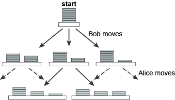

Each node in the tree represents a possible **game state** – an arrangement of the coins after a certain move has been made. Each edge depicts a possible move. From the start position, Bob has three options within the rules of the game, each of which results in a different game state. A couple of Alice’s possible responses to Bob’s splitting the starting stack into a stack of 5 and a stack of 2. Each level in the tree represents the complete set of possible moves that one of the players can make at a certain stage in the game.

It's also possible to show the nodes by using sequences:


The game proceeds in simple deterministic fashion – Bob makes a move, leaving Alice with various options (or, in the end, no legal options), and so on. This is the structure of the problem space, but there is no guidance as to what is a good move or a bad move. So the computer needs know what is the best move.

### Back to trees

Trees representing the problem spaces of problems above are not binary trees, but general trees, in which the binary rule is dropped and any node may have any number of children. A general tree is simply a collection of nodes and edges connecting them with certain restrictions on how these can be arranged:

- One node is specified as the root.
- Every node except the root has one unique parent, where a node’s parent is the node connected to it on a unique path to the root.
- Every node has 0 or more children, a child of a node _v_ being a node of which _v_ is the parent.

trees can also be defined recursively as:

- An empty tree
- A root with 0 or more subtrees.

optimisation problems can be shown to have a tree-shaped problem space, and the best solution lies somewhere within that space. The task is to find a path through the tree to the best solution. Which is just another form of search.

### Implicit Trees

Returning to Grundy’s Game. Psychologists and mathematicians study simple games like these for insights into human decision making, strategy and economic behaviour – a huge area of research known as **game theory**.

As Grundy's game is fairly limited, it's possible to show all possible moves

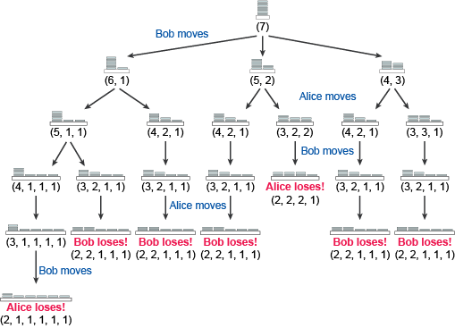

Bob is playing Alice, and Bob moves first. Each move by either player constrains the legal replies the opponent can make, until the game reaches a state at which no further legal moves are possible. These states are labelled in bold red text. The player whose turn it would be to move in that final state loses the game.

The winning stratergy relies on find the path which leads to the other player being unable to make a legal move. This written as a computational problem spec

---
**Name**: GrundyMove  
**Inputs**: A game state represented by a sequence, S1 = (s1, s2, s3, …, sn)
A string _m_, representing the player to move  
**Outputs**: A game state represented by a sequence S2 = (s′1, s′2, s′3, …, s′m), or null  
**Precondition**: 0 < n ≤ 6, 0 < si ≤ 7 for all si in S1 and s1 + s2 + s3 + ⋯ + sn = 7  
**Postconditions**: S2 must result from a legal move or be null (returned if there are no legal moves open to _m_)  
S2 must be the root of a subtree containing the maximum possible number of wins for the player m

---

Game state is represented as a sequence of numbers, each representing the height of one pile of coins, so the state in Figure 5.8 would be represented as (3, 2, 2). From now on, we’ll call a game state arising from a legitimate split of one pile a ‘legitimate successor state’, and we’ll refer to a split that results in such a state as a ‘move’ or a ‘legal move’.

This is – like all optimisation problems – a matter of search, so one possible option would be to set up a data structure representing the game tree, and traverse it using one of the techniques discussed in [Searching](./Searching.md). But this is unnecessary, as in realistic games, this just isn’t an option – their trees are far too complex. Nor is it necessary to store the game tree. All we need to do is let the search process generate parts of the game tree as and when they are needed.

From the problem spec it's possible to glean an initial insight into how the algorithm would work:

From the current game state, find a set of all the legitimate successor states possible from this state. If there are no legitimate successor states, then return null. Otherwise, for each successor state, search the subtree of which it is the root to collect its possible end results (win or loss). Discard successor states that lead only to loss, and return the best state from any states that remain. Make this state the current game stat.

This presents three distinct parts to the problem

- Get the legal successor states.
- Search the tree to gather the potential results from each move to a successor state.
- Choose the best successor state

Written as structured english:

```python
generate all the legal successor states of
  currentState and add them to a list legalStates

IF legalStates is empty

    return null

ELSE

    create a list moveResults

    ITERATE over each item j in legalStates

        evaluate the results from j for m

        add the results to the back of moveResults

set k to position of the best results from moveResults

return the item at k in legalStates
```

Bob is to move first. The list of successor states legalStates will be [(6, 1), (5, 2) and (4, 3)]. The evaluation algorithm burrows down to the leaves of each of these three subtrees, and returns [win, loss, loss] for (6, 1), [loss, win] for (5, 2) and [loss, loss] for (4, 3), resulting in the list moveResults = [[win, loss, loss], [win, loss], [loss, loss]]. Obviously (4, 3) is hopeless for Bob, and is discarded. The algorithm will then return either the first element, (6, 1), or the second element, (5, 2), of legalStates.

But two points need to be clarified:

- How is the evaluation done?
- How is the best move chosen?

The evaluation process takes advantage of the recursive structure of the tree to find the possible wins and losses that would arise from moving to each legal successor state Sn. It works by getting the legal moves possible from each Sn, (S1, S2, …), and recursively finding the wins and losses that arise from each Sn. Eventually, no further legal moves can be generated, at which point the algorithm hits the base case and the game ends with a loss for the player currently to move.

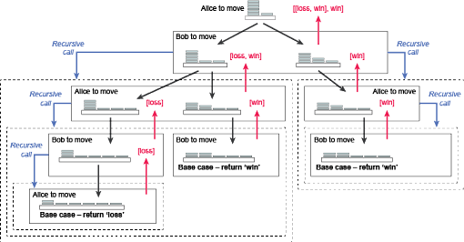

A python implementation of grundy's game based on the above problem spec. See [GrundysGameVsHuman.py](./GrundysGameVsHuman.py) for a version vs a human player

```python
import random


def grundyGame(anInt):
    currentState = [anInt]
    if coinToss() == 'heads':
        toMove = 'Bob'
    else:
        toMove = 'Alice'
    over = False
    while not over:
        legalStates = getLegalStates(currentState)
        if len(legalStates) == 0:
            print(toMove, 'has no legal move left and therefore loses')
            print('*** GAME OVER ***')
            over = True
        else:
            print(toMove + "'s", 'turn,', 'legal moves are:', legalStates)
            moveResults = []
            j = 0
            for j in legalStates:
                moveResults.append(evaluateMove([j], True))
            currentState = makeMove(legalStates, moveResults, toMove)
            toMove = switchMover(toMove)


def coinToss():
    flip = random.randint(0, 1)
    if (flip == 0):
        return 'heads'
    else:
        return 'tails'


def getLegalStates(state):
    legalStates = []
    for j in range(len(state)):
        if state[j] > 2:
            for splitValue in range(1, (state[j] // 2) + 1):
                if splitValue != state[j] - splitValue:
                    newState = state[:j] + [state[j] - splitValue, splitValue] + state[j + 1:]
                    newState.sort(reverse = True)
                    if newState not in legalStates:
                        legalStates.insert(0, newState)
    return legalStates


def evaluateMove(legalStates, myMove):
    if len(legalStates) == 0:
        if not myMove:
            return ['win']
        else:
            return ['loss']
    else:
        j = 0
        moveResults = []
        while j < len(legalStates):
            successorStates = getLegalStates(legalStates[j])
            moveResults = moveResults + evaluateMove(successorStates, switchPly(myMove))
            j = j + 1
    return moveResults


def makeMove(legalStates, moveResults, toMove):
    currentState = getBestMove(legalStates, moveResults)
    print(toMove, 'moves to' , currentState)
    print()
    return currentState


def switchPly(move):
    return not move


def getBestMove(legalStates, moveResults):
    bestMove = legalStates[0]
    highestWinRatio = moveResults[0].count('win') / len(moveResults[0])
    for j in range(0, len(moveResults)):
        ratio = moveResults[j].count('win') / len(moveResults[j])
        if  ratio > highestWinRatio:
            highestWinRatio = ratio
            bestMove = legalStates[j]
    return bestMove


def switchMover(mover):
    if mover == 'Bob':
        mover = 'Alice'
    else:
        mover = 'Bob'
    return mover


grundyGame(11)

```

### Searching Trees

In [TreesAndHeaps](TreesAndHeaps.md) three ways are mentioned to traverse a tree: **preorder, postorder and inorder**. What about the form of traversal does the Grundy’s Game algorithm carry out? A useful way to tackle this question is to trace the order in which the algorithm visits nodes.

Represent a node by its game state (e.g. the root node is (7)), and indicate the nodes visited in bold. Assuming that the successor states of a state are generated in the order that they appear (left to right) in Figure 5.6, the algorithm first generates the states **(6, 1)**, (5, 2) and (4, 3). It visits (6, 1) and generates (5, 1, 1) and (4, 2, 1). It then visits **(5, 1, 1)** and generates (4, 1, 1, 1) and (3, 2, 1, 1). Visiting ***(4, 1, 1, 1)***, it generates and then visits **(3, 1, 1, 1, 1)**. Finally, it generates and visits (2, 1, 1, 1, 1, 1). It has reached a leaf node returning to the last place it had a choice of nodes to visit, which was at the point it had generated (4, 1, 1, 1) and (3, 2, 1, 1). Having already explored the subtree rooted at (4, 1, 1, 1), it now visits **(3, 2, 1, 1)**, generates and visits **(2, 2, 1, 1, 1)** and again reaches a leaf node. Returning to the last choice point, the algorithm now visits **(4, 2, 1) → (3, 2, 1, 1) → (2, 2, 1, 1, 1) → (3, 2, 2) → (2, 2, 2, 1) → (4, 3) → (4, 2, 1) → (3, 2, 1, 1) → (2, 2, 1, 1, 1) → (3, 3, 1) → (3, 2, 1, 1) → (2, 2, 1, 1, 1)** end of search.

The algorithm always dives straight down towards the bottom of the tree until it reaches a leaf node. Only then does it **backtrack** to the last point at which it had a choice of nodes to visit, and then plunges downwards again. A search of this kind is termed **depth first**.

A more _cautious_ strategy might be to visit all of these first, and look at the legal moves from these, and so on, rather than selecting one and immediately racing down its subtree.

Applying this to the Grundy’s Game tree, as before we generate (6, 1), (5, 2) and (4, 3). We start by visiting (6, 1) then visit (5, 2), and then (4, 3). For each of these we generate the legal moves from them, giving (5, 1, 1), (4, 2, 1), (4, 2, 1), (3, 2, 2), (4, 2, 1), (3, 3, 1). We pick the first of these and visit (5, 1, 1), then (4, 2, 1) and so on. Instead of heading straight downwards, as with depth first search, the direction is across the tree – so this style of search is known **breadth first**.

The contrast between the two versions of search is illustrated below:

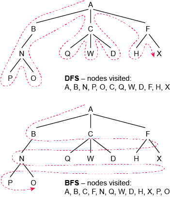

## Graphs

### Definitions

Vertex - Also called a node, is a fundamental part of a graph. it can have a key. A vertex may also have additional information, which is known as the payload.

Edge - also known as an arc, is another key part of a graph. An edge connects two vertices to show that there is a relationship between them. Edges may be one-way or two-way. If the edges are all one-wa, thge graph is a **Directed-Graph**, or a **Digraph**

Weight - Edges may be weighted to shoe that there is a cost to go from vertex to another.

With these definitions, it's possible to more formally define a graph. A graph can be represented by _G_ where _G = (V,E)_. For graph _G_, _V_ is a set of vertices and _E_ a set of edge. Each edge is a **tuple** _(v,w)_, where _w_ ∈ (is an element of) _V_. a third component can be added to the edge tuple to represent a weight. A subgraph _s_ is a set of edges _e_ and vertices _v_ such that _e_ ⊂ _E_ and _v_ ⊂  _V_.

Path - A path in a graph is a sequence of vertices that are connected by edges. Formally a path would be deinfed as _w<sub>1</sub>,w<sub>2</sub>....w<sub>n</sub>_ such that _(w<sub>i</sub> + w<sub>i+1</sub>)_ ∈ _E_ for all (1 ≤ _i_ ≤  _n_ - 1). the unweighted path length is the number of edges in the path, specifically _n_ - 1. The weighted path length is the sum of the qweights of all edges in the path.

Cycle - A cycle in a directed graph is a path that starts and ends at the same vertex. A graph with no cycles is called an **Acyclic graph**. A directed graph with no cycles is called a **Directed acyclic graph** or **DAG**. Several important problems can be solved if they are represented as a DAG.

### Searching a graph

 ---

graph search as a computational problem:
Name: GraphSearch
Inputs: A connected graph G with vertices (v1, v2, v3, …, vn), A vertex v
Outputs: None
Precondition: v is in G
Postcondition: All vi in G are visited, starting with v

---

As mentioned in [Seaching trees](#Searching-Trees) there are two fundamentally different approached to searching, **Depth first** and **Breadth first**

- DFS of a graph: A graph is searched depth first by visiting an initial vertex and then visiting one of its neighbours. After visiting this neighbour you visit one of its neighbours and so on. If you come to a vertex with no neighbours you **backtrack** one stage and visit another neighbour of the previous vertex.
- BFS of a graph: The algorithm visits an initial vertex, and then visits every one of its neighbours. Only when every neighbour has been visited does it visit any neighbour of a neighbour.

Don’t mix up the way the algorithm travels around the graph and the way a salesperson (say) would have to. The algorithm systematically searches all the vertices of a graph in a way that takes advantage of the graph’s structure, and so can visit vertices in any order, backtrack the wrong way across directed edges, move between nodes not connected by an edge, etc. – it is simply trying out alternatives. In contrast, the salesperson has to obey the rules of the graph.

### DFS of a graph

Because it has directed edges and no cycles, there is no danger of a search of a tree going round in circles. However, an algorithm traversing the vertices of a graph needs some way in which to detect when a vertex has already been visited, or it might continue endlessly revisiting vertices and never terminate. The traditional way to record when a vertex has been visited is to give each vertex a colour, white or black. Unvisited vertices are coloured white. When a vertex is visited, its colour is changed to black and black vertices are not revisited.

An example of DFS in python that alters the colour to denote a searched node.

``` python
graph1 = {
    1: {'colour': 'white', 'neighbours': [2, 3, 4]},
    2: {'colour': 'white', 'neighbours': [1, 4, 5]},
    3: {'colour': 'white', 'neighbours': [1, 4]},
    4: {'colour': 'white', 'neighbours': [1, 2, 3]},
    5: {'colour': 'white', 'neighbours': [2]}}

def dfs(vertex, graph):
    v = vertex
    g = graph

    print('Visiting', v, '- setting it to black')
    g[v]['colour'] = 'black'
    for w in g[v]['neighbours']:
        print('  checking neighbour', w, '- colour is', g[w]['colour'])
        if g[w]['colour'] is 'white':
            dfs(w, g)
            print('Unwinding back to', v)
    print('  all neighbours of', v, 'have been visited')

def(0, graph1)
```

Depth first search of a tree or graph is sometimes described as ‘adventurous’ search. From a certain vertex, one of its immediate neighbours is visited, then one of its neighbours is visited and so on. So, if a vertex has immediate neighbours X and Y and X is visited first, then DFS searches all paths starting at node X before searching paths starting at node Y.

If you come to a vertex with no (unvisited) neighbours you backtrack one stage and visit another neighbour of the previous vertex. Each visited vertex is ‘marked’ to make sure that it is not visited again, to avoid endless cycles of revisiting the same vertices.

### Spanning trees

A spanning tree is just a subset of the graph’s edges that connect up all the vertices, without including any closed circuits. It therefore contains a minimal set of edges that connect up all the nodes. The tree corresponding to visiting the vertices in the order 1, 2, 4, 3, 5 is below:

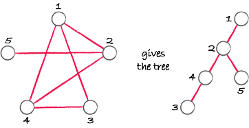

Spanning trees may not be unique: in general, a graph will have many different ones, and starting a DFS of a graph from different initial vertices will generate different spanning trees. An unconnected graph cannot have a spanning tree.

BFS also creates a spanning tree, the corresponding tree for stating at node 2 and traversing the tree using a bredth first search is below:

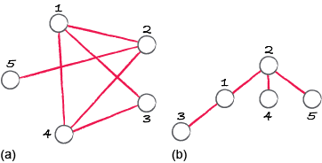

Some sample python code to demonstrate this:

``` python
tree1 = {
    0: {'colour': 'white', 'neighbours': [1, 2]},
    1: {'colour': 'white', 'neighbours': [0, 3, 4]},
    2: {'colour': 'white', 'neighbours': [0, 5, 6]},
    3: {'colour': 'white', 'neighbours': [1]},
    4: {'colour': 'white', 'neighbours': [1]},
    5: {'colour': 'white', 'neighbours': [2, 9]},
    6: {'colour': 'white', 'neighbours': [2, 7, 8]},
    7: {'colour': 'white', 'neighbours': [6]},
    8: {'colour': 'white', 'neighbours': [6, 10]},
    9: {'colour': 'white', 'neighbours': [5]},
    10: {'colour': 'white', 'neighbours': [8]}}

def bfs(vertex, graph):
    g = graph
    queue = []
    queue.append(vertex)

    while len(queue) > 0:
        u = queue.pop(0)
        g[u]['colour'] = 'black'
        print('Visiting', u)
        for w in g[u]['neighbours']:
            if g[w]['colour'] is 'white':
                queue.append(w)
                g[w]['colour'] = 'grey'

def dfs(vertex, graph):
    g = graph
    queue = []
    queue.append(vertex)
    while len(queue) > 0:
        u = queue.pop()
        print('Visiting', u)
        g[u]['colour'] = 'black'
        for w in g[u]['neighbours']:
            if g[w]['colour'] is 'white':
                queue.append(w)
                g[w]['colour'] = 'grey'


print('BFS traversal of tree1 starting at 0')
bfs(0, tree1)
print('---------------------------------')
print()

tree1 = {
    0: {'colour': 'white', 'neighbours': [1, 2]},
    1: {'colour': 'white', 'neighbours': [0, 3, 4]},
    2: {'colour': 'white', 'neighbours': [0, 5, 6]},
    3: {'colour': 'white', 'neighbours': [1]},
    4: {'colour': 'white', 'neighbours': [1]},
    5: {'colour': 'white', 'neighbours': [2, 9]},
    6: {'colour': 'white', 'neighbours': [2, 7, 8]},
    7: {'colour': 'white', 'neighbours': [6]},
    8: {'colour': 'white', 'neighbours': [6, 10]},
    9: {'colour': 'white', 'neighbours': [5]},
    10: {'colour': 'white', 'neighbours': [8]}}

print('DFS traversal of tree1 starting at 0')
dfs(0, tree1)
```

### BFS of a graph

Recall the approach taken by BFS.

    Visit an initial vertex, and then visit every one of its neighbours. Only when every neighbouring vertex has been visited then move to a neighbour of a neighbour. Each time the search comes to a new vertex it visits all of its neighbours before visiting any that are further from the start.

The below algorithm is a little more involved than for DFS. The idea is that a to-do list of vertices is kept of what is known, but have not visited yet.
The list is a queue, so the next vertex to visit will always be the one at the front.

As with DFS, the vertices are coloured:

- Black for a visted vertex
- Grey for a vertex waiting in the queue
- white for an unreached vertex

Then while the to-do queue is not empty, the following actions are repeated:

- Remove the first vetex in the queue, visit the location and colour is black
- Locate it's neighbours. Those that are white, will be turned grey and added to the end of the queue

``` python
create queue

add v to the back of the queue

ITERATE while queue is not empty
    remove u from the front of the queue
    set colour of u to black
    ITERATE over all w that are neighbours of u
        IF the colour of w is white
            set the colour of w to grey
            add w to the back of the queue
```

A python implementation of BFS

``` python

graph1 = {
    1: {'colour': 'white', 'neighbours': [2, 3, 4]},
    2: {'colour': 'white', 'neighbours': [1, 4, 5]},
    3: {'colour': 'white', 'neighbours': [1, 4]},
    4: {'colour': 'white', 'neighbours': [1, 2, 3]},
    5: {'colour': 'white', 'neighbours': [2]}}

def bfs(vertex, graph):
    g = graph
    queue = []
    queue.append(vertex)
    while len(queue) > 0:
        print('Queue is now', queue)
        print()
        u = queue.pop(0)
        print('Visiting', u, '- setting it to black')
        g[u]['colour'] = 'black'
        for w in g[u]['neighbours']:
            print('  checking neighbour', w, '- colour is', g[w]['colour'])
            if g[w]['colour'] is 'white':
                print('  appending neighbour', w, 'to queue and setting it to grey')
                queue.append(w)
                g[w]['colour'] = 'grey'

bfs(1, graph1)
```

### Analysis of BFS and DFS

DFS and BFS visit every vertex and explore every edge, so the complexity is O(|V| + |E|). If the graph is sparse, this is essentially the same as O(|V|).

The densest possible graph is represented by an adjacency matrix in which every cell is full, so there are |V| × |V| = |V|2 edges. In this case O(|V| + |E|) becomes O(|V| + |V|<sup>2</sup>), which is the same as O(|V|<sup>2</sup>).

## Distance Problems

### Dijkstra’s algorithm

The goal of Dijkstra’s algorithm is to find a path with the minimum distance from a given start vertex (the source) to each other vertex in the graph. The complexity is the same as if we just wanted to compute the shortest distance from the source to some particular vertex, rather than to all of them.

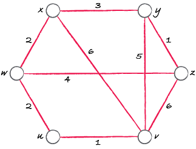

The shortest path between two vertices u and v cannot visit any vertex more than once beacause
if the path visited the same vertex twice then it would contain a **cycle**. We could then delete some of the edges in the cycle and reduce the path’s overall distance, which is impossible if it is the shortest path.

Much like BFS Dijkstra's algortihm is iterative and hold the vertices waiting to be process in a data structure. However rather than a FIFO queue, it uses a **priority queue**.

In a normal queue items are added to the back and removed from the front, whereas a priority queue, items are added into a position based on their priority, where the lower the number the higher the priority. Thus, if a new item is added with a priority higher than any already in the queue it will be moved immediately to the front, ‘bumping’ existing items with lower priority down the queue. It is also possible for the priority of an item already in the queue to be changed, whereupon the queue will be reordered.

An example of a priority queue ADT (Abstract Data Type)

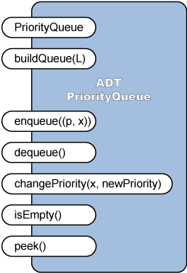

Briefly summarised, these operations carry out the following tasks:  

PriorityQueue - Sets up an empty priority queue  
buildQueue(L) - Builds a priority queue from the list L  
enqueue((p, x)) -Adds item x to the queue, with priority of p. Note that it is a tuple (p, x) that is added here  
dequeue() - Returns the highest priority item and removes it from the queue  
changePriority(x, newPriority) - Changes the priority of item x in the queue to the amount specified by newPriority, and rearranges the queue to reflect this change.  
isEmpty() - Returns a Boolean stating if the priority queue is empty or not.  
peek()- Returns the highest priority item without removing it from the queue.  

As with any data structure based on an ADT, it is not necessary for clients to be aware of how these operations actually work.

With the object of the algorithm to find the shortest path from the source to each of the other vertices, we record against each vertex the length of the shortest path to it found so far. As the algorithm progresses this value is updated whenever a shorter path is discovered.

Initially, the distance to the source vertex is 0 (it is zero distance from itself!). there is no information yet about the other distances, so set them all to some suitably large value, conventionally called ‘infinity’. Then add all the vertices to a **priority queue**, sorted by current distance. The source has the smallest distance (zero versus infinity for all the others) so it will be at the front.

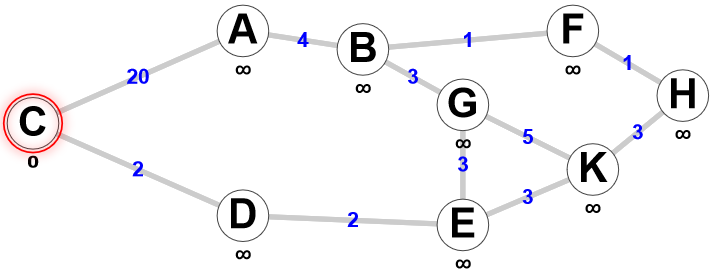

While the priority queue is not empty we repeat these steps:

- Remove the vertex at the front of the queue. Call the distance of this vertex the base distance.
- Locate its neighbours. For each neighbour, compute a new distance by adding together the base distance and the length of the edge going to that neighbour.
- If the new distance is less than the neighbour’s current distance, we have found a shorter path to the neighbour, so replace the neighbour’s distance by the new distance.

A more formal, strucutured english version:

``` python
create priority queue

set dist to 0 for v and dist to infinity for all other vertices

add all vertices to priority queue

ITERATE while priority queue is not empty

    remove u from the front of the queue

    ITERATE over w in the neighbours of u

        set new distance to dist u + length of edge from u to w

        IF new distance is less than dist w

            set dist w to new distance

            change priority(w, new distance)
```

``` python
from pythonds.graphs import PriorityQueue

infinity = 100

graph4 = {
    'u': {'dist': infinity, 'edgeTo': {'v': 1, 'w': 2}},
    'v': {'dist': infinity, 'edgeTo': {'u': 1, 'x': 6, 'y': 5, 'z': 6}},
    'w': {'dist': infinity, 'edgeTo': {'u': 2, 'x': 2, 'z': 4}},
    'x': {'dist': infinity, 'edgeTo': {'v': 6, 'w': 2, 'y': 3}},
    'y': {'dist': infinity, 'edgeTo': {'x': 3, 'v': 5, 'z': 1}},
    'z': {'dist': infinity, 'edgeTo': {'v': 6, 'w': 4, 'y': 1}}}

graph5 = {
    'u': {'dist': infinity, 'edgeTo': {'v': 2, 'w': 5, 'x': 1}},
    'v': {'dist': infinity, 'edgeTo': {'u': 2, 'w': 3, 'x': 2}},
    'w': {'dist': infinity, 'edgeTo': {'u': 5, 'v': 3, 'x': 3, 'y': 1, 'z': 5}},
    'x': {'dist': infinity, 'edgeTo': {'u': 1, 'v': 2, 'w': 3, 'y': 1}},
    'y': {'dist': infinity, 'edgeTo': {'x': 1, 'w': 1, 'z': 1}},
    'z': {'dist': infinity, 'edgeTo': {'w': 5, 'y': 1}}}

def dijkstra(source, graph):
    pQueue = PriorityQueue()
    graph[source]['dist'] = 0
    for v in graph:
        pQueue.enqueue((graph[v]['dist'], v))
    while not pQueue.isEmpty():
        u = pQueue.dequeue()
        baseDist = graph[u]['dist']
        print('Visiting',u, 'at distance', baseDist)
        print('Edges from this vertex', graph[u]['edgeTo'])
        for w in graph[u]['edgeTo']:
            edgeLen = graph[u]['edgeTo'][w]
            newDist = baseDist + edgeLen
            currentDist = graph[w]['dist']
            if newDist < currentDist:
                graph[w]['dist'] = newDist
                print('Distance to', w, 'set to', baseDist, '+', edgeLen, '=', newDist)
                pQueue.changePriority(w, newDist)
        print()
    print('Final result: distances of all vertices from ' + source)
    distancesList = []
    for v in graph:
        distancesList.append((v, graph[v]['dist']))
    print(distancesList)

dijkstra('u', graph4)
```

### Complexity of Dijkstra’s algorithm

it can be shown that operations on a priority queue of size n have complexity O(log n). Basically, this is because the queue stores data in a complete binary tree, the height of which is log n, where n is the number of vertices. Inserting or removing an item thus requires effort proportional to log n. In Dijkstra’s algorithm, operations on the priority queue will have complexity O(log(|V|)), since the size of the queue is |V|. Each vertex is removed once, which gives a contribution of O(|V| × log(|V|)) = O(|V| log(|V|)).

The number of times the inner loop is executed altogether, across all iterations of the outer loop, can be found by adding up how many neighbours all the vertices have put together. If vertices u and v are joined by an edge, then v is a neighbour of u and u is also a neighbour of v. Each edge therefore contributes exactly 2 to the count of neighbours and the total number of neighbours across all vertices is exactly 2|E|.

The number of times the priority of a vertex in the queue is changed cannot exceed this number and since changing the priority has complexity O(log |V|), the total contribution of the inner loop is O(2|E| × log(|V|)) = O(|E| log(|V|)). (Remember that multiplying by a constant does not affect orders of magnitude, so O(2|E| log(|V|)) and O(|E| log(|V|)) are the same.)

Other steps in the algorithm are of complexity O(|V|) and O(|E|), which are lower orders of magnitude. Hence, Dijkstra’s algorithm has complexity O((|V|+|E|) log(|V|)).

## Greedy Algorithms

In computation, greedy is sometimes good.

Greedy algorithms are algorithms that always go for short-term advantage. Sometimes this turns out to be best in the long run as well, as they make a choice that is optimal for themselves in that step and this is what really defines a greedy algorithm; an algorithm that will make
the locally optimal choice at each stage of its execution reducing the problem into a smaller one but dealing with any problems that could crop up from this later on. Once the choice has been made they
stick with it.

### MST & Prim's algorithm

As mentioned in the [Spanning Trees](#Spanning-trees)  , every graph has at least one spanning tree, which will haveexactly V-1 edges, and in general there will be many spanning trees, even in a sparse graph. An MST for a weighted graph is simply a spanning tree that minimises the sum of the of the wightes along it's edges.

The concept of MST is important beacuse it allows us to prove a lower bound of traversing the graph, for instance this is helpful for finding routes, or the shortest route for data to travel on a network.

The left graph on the below image shows a tour of cities whereas the right shows the MST of this tour, which has one edge removed, we can see this is a spanning tree as it connects every vertex and contains no cycles. Giving us ```length of tour > length of path ≥ length of MST tree```

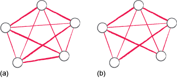

Prim's algoithm is a greedy solution to the problem of finding an MST. The algorithm starts from a chosen vertex and grows the MST vertex by vertex, at each stage there are two kinds of vertex:

- Those in the current tree
- Those _not_ in the current tree

Prim's works from the following principle:

Amoungst all the edges that join a vertex in B to one in A find the shortest. suppose this edge joins _w_ in set B to _u_ in set A. Then add the edge _uw_ to the tree. This adds the vertex that is closest to the existig tree, so the tree is extended at the least possible cost, following the greedy principle.

Below is a structured english version of the algorithm that uses a priority queue. For each vertex in the queue, it keeps track of the shortest edge that could connect that vertex to the current tree, and which vertex in the current tree that edge goes to, holding them in order of how close they are to the existing tree, with the closest at the front. Adding the edge that links the vertex at the front of the priority queue to the corresponding nearest vertex in the tree therefore represents the greedy choice at each stage.

As each vertex is processed, the algorithm first adds this new edge to the tree. Now that this new vertex has been added, the algorithm then removes the vertex from the front of the queue and checks whether any of its neighbours should have their shortest distances updated. If so, it changes their position in the queue.

```python
create minimum spanning tree

create priority queue

set dist to 0 for v and dist to infinity for all other vertices

add all vertices to priority queue

ITERATE while priority queue is not empty

    remove u from the front of priority queue

    ITERATE over w in the neighbours of u

        set edge length to length of edge from u to w

        if w is in priority queue and edge length < dist w

            set dist w to edge length

            changePriority(w, edge length)

            record nearest in tree to w is u

    if priority queue is not empty

        set next vertex to peek(priority queue)

        add edge (nearest in tree to next vertex, next vertex) to minimum spanning tree
```

A sample python implementation

```python
from pythonds.graphs import PriorityQueue

# setting infinity to 100 is sufficient here
infinity = 100

graph1 = {
    'u': {'dist': infinity, 'edgeTo': {'v': 1, 'w': 2}},
    'v': {'dist': infinity, 'edgeTo': {'u': 1, 'x': 6, 'y': 5, 'z': 6}},
    'w': {'dist': infinity, 'edgeTo': {'u': 2, 'x': 2, 'z': 4}},
    'x': {'dist': infinity, 'edgeTo': {'v': 6, 'w': 2, 'y': 3}},
    'y': {'dist': infinity, 'edgeTo': {'x': 3, 'v': 5, 'z': 1}},
    'z': {'dist': infinity, 'edgeTo': {'v': 6, 'w': 4, 'y': 1}}}

graph2 = {
    'A': {'dist': infinity, 'edgeTo': {'B': 7, 'D': 5}},
    'B': {'dist': infinity, 'edgeTo': {'A': 7, 'C': 8, 'D': 9, 'E': 7}},
    'C': {'dist': infinity, 'edgeTo': {'B': 8, 'E': 5}},
    'D': {'dist': infinity, 'edgeTo': {'A': 5, 'B': 9, 'E': 15, 'F': 6}},
    'E': {'dist': infinity, 'edgeTo': {'B': 7, 'C': 5, 'D': 15, 'F': 8, 'G': 9}},
    'F': {'dist': infinity, 'edgeTo': {'D': 6, 'E': 8, 'G': 11}},
    'G': {'dist': infinity, 'edgeTo': {'E': 9, 'F': 11}}}

graph3 = {
    'A': {'dist': infinity, 'edgeTo': {'B': 5, 'C': 6, 'D': 4}},
    'B': {'dist': infinity, 'edgeTo': {'A': 5, 'C': 1, 'D': 2}},
    'C': {'dist': infinity, 'edgeTo': {'A': 6, 'B': 1, 'D': 2, 'E': 5, 'F': 3}},
    'D': {'dist': infinity, 'edgeTo': {'A': 4, 'B': 2, 'C': 2, 'F': 4}},
    'E': {'dist': infinity, 'edgeTo': {'C': 5, 'F': 4}},
    'F': {'dist': infinity, 'edgeTo': {'C': 3, 'D': 4, 'E': 4}}}


def prim(first, graph):
    pQueue = PriorityQueue()
    graph[first]['dist'] = 0
    for i in graph:
        pQueue.enqueue((graph[i]['dist'], i))
    mst = []
    # dictionary to record for each vertex in the queue its nearest vertex in the tree
    nearestInTreeTo = {}
    print('Removing front item', first, 'from priority queue')
    while not pQueue.isEmpty():
        u = pQueue.dequeue()

        print('Inspecting neighbours of vertex', u)

        for w in graph[u]['edgeTo']:

            edgeLen = graph[u]['edgeTo'][w]
            print(u, 'to', w,':', edgeLen)

            currentDist = graph[w]['dist']
            if w in pQueue and edgeLen < currentDist:
                graph[w]['dist'] = edgeLen
                pQueue.changePriority(w, edgeLen)
                nearestInTreeTo[w] = u

        if not pQueue.isEmpty():

            print('PriorityQueue is now :', pQueue.getEntries())
            print()

            nextVertex = pQueue.peek()
            print('Next vertex is:', nextVertex)
            weight = graph[nextVertex]['dist']
            newEdge = [[(nearestInTreeTo[nextVertex], nextVertex), weight]]


            print('Nearest in tree to', nextVertex,'is', nearestInTreeTo[nextVertex])
            print('Adding', newEdge, 'to the tree')
            mst = mst + [[(nearestInTreeTo[nextVertex], nextVertex), weight]]

            print('Tree is now :', mst)
            print()
            print('Removing front item', nextVertex, 'from priority queue')

    print('MST completed')
    return mst


def sumWeights(aTree):
    totalWeight = 0
    for edge in tree:
        totalWeight = totalWeight + edge[1]
    return totalWeight
```

### Topological Sort

An important fact about a **directed acyclic graph** (DAG) is that the vertices can always be sorted into an order that is consitant with the direction of the edges. If there was an edge going from vertex _u_ to vertex _v_, then _u_ will appear before _v_ in the sorted order, this is **topological sort**

Topological sorting is important in many scheduling tasks where takss depend on other tasks having been completed first. If the dependenices are shown as a digraph and then find a topological sort  that will gice the order in which to carry out the tasks and know that as we come to each task any dependent tasks will have been completed.

A method for finding the topological sort of a DAG is couting the number of incoming edges to a node, an initial insight into this is

- Identify a vertex with no incoming edges and add it to the topological sort.
- Remove the vertex and all its outgoing edges from the graph.
- Repeat the process untill all the vertices have been removed.

At each stage there is always a DAG, beacause starting with one and removing a vertex and its outgoing edges cannnot create a cycle.

To see that a DAG must always contain a vertex with no incoming edges, imagine starting at any vertex and swimming upstream against the direction of the arrows. If every vertex has an incoming edge for you to swim upstream against, you will always be able to keep going. The only way that’s possible is if you are going round in circles. But in an acyclic graph it’s impossible go round in circles by definition!

In fact, our algorithm doesn’t literally remove the vertex and edges from the digraph but just works with a dictionary which records how many edges come into each vertex. For the DAG in Figure 5.27, the dictionary would be:


itially the vertex with no incoming edges is 4 and edges go from there to vertices 3 and 5. After vertex 4 has been removed the edge count for these vertices will each be reduced by 1, so the dictionary will now be

{1: 1, 2: 2, 3: 0, 5: 1, 6: 1}

a python example of topological sort

```python
digraph1 = {
    1: [2],
    2: [],
    3: [1, 6],
    4: [3, 5],
    5: [],
    6: [2, 5]}

digraph2 = {
    '3/4 cup milk':['1 cup mix'],
    '1 egg':['1 cup mix'],
    '1 Tbl Oil':['1 cup mix'],
    '1 cup mix':['pour 1/4 cup', 'heat syrup'],
    'heat syrup':['eat'],
    'heat griddle':['pour 1/4 cup'],
    'pour 1/4 cup':['turn when bubbly'],
    'turn when bubbly':['eat'],
    'eat':[]
}

# Returns a dictionary of incoming edges at each vertex
def getVertexDictionary(aDigraph):
    vDict = {}
    for v in aDigraph:
        vDict[v] = 0
    for v in aDigraph:
        for w in aDigraph[v]:
            vDict[w] = vDict[w] + 1
    return vDict

# Returns the set of vertices with no incoming edges
def getVertexSet(aDict):
    vertexSet = set()
    for v in aDict:
        if aDict[v] == 0:
            vertexSet.add(v)
    return vertexSet

# Finds topological sort
def topSort(digraph):
    # Initial count of incoming edges at each vertex
    vertexDict = getVertexDictionary(digraph)
    print('Initial dictionary of incoming edges at each vertex:', vertexDict)
    print()
    # Holding set of vertices with zero incoming edges
    vertexSet = getVertexSet(vertexDict)
    # List to hold vertices in topologically sorted order
    topsort = []

    while len(vertexSet) > 0:
        print('   Set of vertices with no incoming edges:', vertexSet)
        # Remove a vertex with no incoming edges from the holding set...
        v = vertexSet.pop()

        # ...and from the count
        del vertexDict[v]
        print('  ', v, 'removed from set and dictionary')
        # ...and add the vertex to topological sort
        topsort.append(v)
        # For each vertex that the removed vertex has an edge to
        for w in digraph[v]:
            print('      Decreasing incoming edges count for', w)
            # Decrease the incoming vertex count...
            vertexDict[w] = vertexDict[w] - 1
            # ... and if its count becomes zero add the vertex to the holding set
            if vertexDict[w] == 0:
                vertexSet.add(w)
                print('     ', w, 'now has zero incoming edges so added to the set')
        print('   Dictionary is now:', vertexDict)
        print()
    return topsort

```

## Dynamic Programming

Divide and conquer is a common technique for solving problems, however for this to be effcient the sub problems should be distinct otherwise we could end up solving the same subproblem repeatedly.

An example of this is the Fibonacci sequence, which comprises of the simple rule that each number after the first two is the addition of the previous pair.

The can be easily coded as a recursive function:

```python
def fib(n):

    if n == 0:

        return 0

    if n == 1:

        return 1

    return fib(n-1) + fib(n-2)
```

 however it is extremely inefficient:

 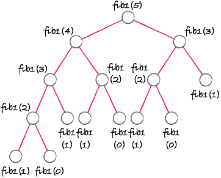

 This generates many calls, most of which are duplicates of others, creating wasted effort. One idea to prevent this may be to store the result globally, and lookup up the number when needed, known as **memosiation** or **caching**

 ```python
fibs = {0:0,1:1}

def fib2(n):

    global fibs

    if n not in fibs:

        fibs[n] = fib2(n-1) + fib2(n-2)

    return fibs[n]
 ```

In some problems, memoisation may be the best we can do to avoid redundant calculations. But in this case we can see that:

    fib2(0) and fib2(1) are required to compute fib2(2)
    fib2(1) and fib2(2) are required to compute fib2(3)
    fib2(2) and fib2(3) are required to compute fib2(4)

So we can be more forward looking and systematically compute a list of Fibonacci numbers, working from the bottom up, with the guarantee that as we compute each new value it depends only on ones we have already filled in:

```python
def fib3(n):

    f = [0, 1]

    for i in range(2, n+1):

        f.append(f[i-1] + f[i-2])

    return f[n]
```

The reason this works is that we have a structure of subproblems that form a DAG. For every DAG, we know there is a topological sort, and so we can solve the subproblems in the order of the sort. Thus each time we come to a subproblem, all the other subproblems it relies on are certain to have been solved already.

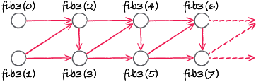

The topological sort in this case is easy to see: fib3(0) and fib3(1) come first and then we iteratively calculate fib3(2), fib3(3), etc. until we reach the Fibonacci number we want.

This is the essence of **dynamic programming (DP)**. If we can break a problem up into a series of subproblems whose dependencies on one another form a DAG, then we can solve each problem in the order of a topological sort, and be sure that as we come to each new subproblem all the other subproblems it relies on have already been solved. Where a problem can be broken up in this way we say it has the **DP property**.

    The expression ‘dynamic programming’ was invented by Richard Bellman (1920–1984). The ‘programming’ part is nothing directly to do with computer programming, but comes from project planning, in which programming refers to scheduling a series of interdependent tasks. Bellman seems to have named it ‘dynamic’ because he wanted to give a general feeling that it was progressive and multistage.

Calculating Fibonacci numbers using DP is startlingly more efficient than recursion. The recursive algorithm fib1 is exponential (it is of order O(φn), where φ is the golden ratio, approximately 1.618), but fib3, using DP, is O(n).

## Optimisation problems

Often the real world throws down challenges where arriving at the best solution, efficiently and in a reasonable time is simply impossible: the problems are too complex, the problem space is too vast, there are too many variables.

An old engineering maxim states: ‘Fast, cheap, reliable. Choose two.’ This encapsulates the melancholy truth that, for most real-world problems, the solutions cannot be all of:

- optimal (i.e. the best solution)
- polynomial (i.e. complexity O(ni), where i ≥ 2), or better
- guaranteed to work for any input

at the same time. Something has to be sacrificed. In cases such as these, algorithm designers have three main options. They can:

- relax the time requirements. It may be acceptable for the algorithm to take hours, or even days, to arrive at a solution. However, it may never be certain whether such algorithms will terminate in any reasonable time for every input
- relax the optimality requirements and settle for solutions that approximate to the optimum by a certain factor
- relax optimality requirements and look for solutions that are ‘good enough’.

Algorithms based on the second and third approaches are known generally as approximate algorithms (though sometimes this term is interpreted more narrowly as only applying to the second approach).

### The knapsack problem

Suppose you visit Treasure Island and are lucky enough to stumble across a pirate treasure chest, containing virtually unlimited quantities of three kinds of precious jewel:

|Item|Weight|Value|
|----|------|-----|
|Ruby|2Kg|$M 3|
|Emerald|4Kg|$M 6|
|Diamond|5Kg|$M 7|

Luckily you have a bag in which you can stuff as many as you want of each kind of jewel, but there is just one snag. The budget airline you are travelling with has tough restrictions on baggage. The heaviest bag of jewels you will be able to take on the plane is 12 kg. What collection of jewels should you choose to maximise your profit?

One way to solve this problem is brute force, but that can be time consuming and cumbersome. instead it's better to look for a way to break the problem down into subproblems.

One way to look to as this is to imagine you have found the maximum, and the last jewel you added was a ruby. Suppose you take the ruby out again. Now the total weight is reduced by 2 kg and the remaining jewels must represent the optimum solution for a bag weighing 10 kg. Why must they? Because if there were a better solution for 10 kg you could use that, put the ruby back and end up with a better solution to the 12 kg problem!

Similarly, if the last jewel added was an emerald, then removing it would leave the optimum solution for an 8 kg bag and if the last jewel was a diamond removing it would leave the optimum solution for a 7 kg bag. And since it’s the optimum, the contents of the optimum 12 kg bag must in fact be whichever of these three combinations is the most valuable.

More formally, if we write b(w) for the optimum that can be achieved for a bag of weight w then

b(12) is the largest of:

    b(12 − 2) + 3
    b(12 − 4) + 6
    b(12 − 5) + 7

In this reasoning, there was nothing special about 12. We could have applied the same argument to any other bag weight w, and so in general

b(w) is the largest of:

    b(w − 2) + 3
    b(w − 4) + 6
    b(w − 5) + 7

except that we don’t include cases where the subtraction leaves a negative value.

A crude algorithm can be constructed, that focuses on finding the highest value.

```python
bagweight = 12

weight = [2,4,5]

value = [3,6,7]

b = [0,0,0,0,0,0,0,0,0,0,0,0,0]

#for each weight

for w in range(1, bagweight+1):

    currentbest = 0

    # test effect of removing each jewel in turn

    for jewel in range(3):

        # if it is light enough to be allowed

        if weight[jewel] <= w:

            # the weight of the bag before this jewel was added

            previousweight = w - weight[jewel]

            # by adding this jewel to it the bag value would be

            possiblebest = b[previousweight] + value[jewel]

            # if this bag value is better than the best so far

            if possiblebest > currentbest:

                # make it the best

                currentbest = possiblebest

    # we have checked each jewel so we now know the best value for bag
    weight no bigger than w

    b[w] = currentbest

#now repeat for the next value of w

```

below is a more formalised version that can find the optimum for any bag weight:

```python
bagWeightLimit = 12
jewelWeights = [2, 4, 5]
jewelValues = [3, 6, 7]
jewelNames = ['ruby', 'sapphire', 'diamond']

# Set up a list that will hold optimum values for weights 1 to bagWeightLimit.
# We give index zero a dummy value for convenience (which we won't use) as we
# want to index bagValues from 1 rather than zero.
bagValues = [0, 0, 0, 0, 0, 0, 0, 0, 0, 0, 0, 0, 0]

for w in range(1, bagWeightLimit + 1):
    print('Weight limit of bag =', w)
    bestValueForWeight = 0
    for jewel in range(3):
        print('Checking if a', jewelNames[jewel], 'weight =', jewelWeights[jewel], ', value =', jewelValues[jewel], 'could be added')
        if jewelWeights[jewel] <= w:
            print('  A', jewelNames[jewel], 'could be added')
            previousBagWeight = w - jewelWeights[jewel]
            print('  Without the', jewelNames[jewel],'the previous weight of the bag must have been', w, '-', jewelWeights[jewel], '=', previousBagWeight)
            print('  The best possible value for a bag with a weight limit of', previousBagWeight, 'was', bagValues[previousBagWeight])
            possibleBestValue = bagValues[previousBagWeight] + jewelValues[jewel]
            print('  Adding the value of a', jewelNames[jewel], 'gives a total value for this bag of', bagValues[previousBagWeight], '+', jewelValues[jewel], '=', possibleBestValue)
            if possibleBestValue > bestValueForWeight:
                bestValueForWeight = possibleBestValue
                print(' ', possibleBestValue, 'is a new best value for a bag of weight', w)
            else:
                print('  This is not better than the current best value of', bestValueForWeight)
        else:
            print('  A', jewelNames[jewel], 'would exceed the bag weight limit')

    bagValues[w] = bestValueForWeight
    print('The optimum total value for a bag with a weight limit of', w, 'is', bagValues[w])

```

the above is a special case of the knapsack problem, and will only work for the predetermined values however it's possible to generalise this to accept any range of items, with weights and values along with any bag size.

``` python
def knapsack(itemWeights, itemValues, bagWeightLimit):

    # Set up a list that will hold optimum values for weights 1 to bagWeightLimit.
    # We give index zero a dummy value for convenience (which we won't use) as we
    # want to index bagValues from 1 rather than zero.
    bagValues = [0] * (bagWeightLimit + 1)

    for w in range(1, bagWeightLimit + 1):
        bestValue = 0
        for x in range(len(itemWeights)):
            if itemWeights[x] <= w:
                previousBagWeight = w - itemWeights[x]
                possibleBest = bagValues[previousBagWeight] + itemValues[x]
                if possibleBest > bestValue:
                    bestValue = possibleBest
        bagValues[w] = bestValue

    # print the optimum total value for a bag of bagWeightLimit
    print(bagValues[w])

itemWeights = [12, 2, 1, 4, 1]
itemValues = [4, 2, 1, 10, 2]
bagWeightLimit = 15

knapsack(itemWeights, itemValues, bagWeightLimit)

```

The Treasure Island puzzle is an example of an **unbounded knapsack**, in which as many copies of each item are avaliable. Other variants to the knapsack problem exist, for instance there is the fractional knapsack, that has the greedy property, there is also the 0-1 knapsack, in which there is only one copy of each item avaliable, so it can be included or not. 

### Levenshtein distance aka edit distance

Strings often need to be compared for a range of different things, one of those is distance, say for instance  if a spell checker needed to compare for inaccuracies.

The edit distance counts the minimum number of changes needed to get from one string to another. Three kinds of edit operation are taken in account:

- Replacement
- Deletion
- Insertion

For example, suppose we want to change TREES to FOREST. The fewest possible number of edits is four:  
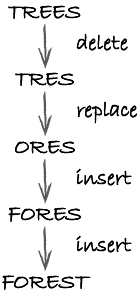

Computing the edit distance is a good candidate for Dynamic Programming as a brute force method would require too many comparisons.

A good example of this is finding the edit distacnce between prefixes of two words we are comparing. S & T will be used to represent the two words, where S(i) is the first i characters of S and T(j) the first j characters of T, so if S it TREES, then s(3) is TRE, S(0) would be an empty string, and S(5) would be the whole string TREES.

e(i,j) will be used to represent the minimum edit distance between S(i) and T(j).

To make a connection with smaller subproblems, suppose S(i) and T(j) have been built from S(i − 1) and T(j − 1) by adding characters X and Y, respectively

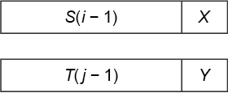

To get to the point of having a calculated edit distance, it's possible to list all the routes and count the cost of each interms of edit steps:

1 - If X and Y are a match, i.e. identica, for the shortest distance, edit S(i − 1) to T(j − 1).  
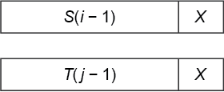

2 - If X and Y are different there is a mismatch. One of three things can then be done, each of which might be optimal:

- Replace X by Y, then edit S(i − 1) to T(j − 1)

    The cost is 1 for the replacement plus e(i − 1, j − 1) for the edit.

    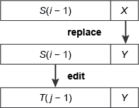

- Delete X, then edit S(i − 1) to the whole of T(j)  

    The cost is 1 for the deletion plus e(i − 1, j) for the edit.  
    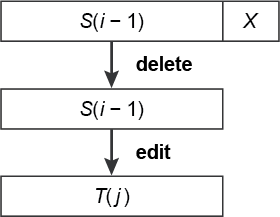

- Edit S(i) to T(j − 1), then insert Y

    The cost is e(i, j − 1) plus 1 for the insertion.  
    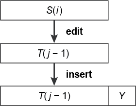

For e(i, j) to be the minimum edit distance we must choose whichever of these possibilities gives the fewest number of edits. We don’t know which one it’s going to be before we do the calculations for the particular strings. But if we use diff(i, j) to mean 0 if X and Y match, and 1 if they don’t, we can write the following relation.

e(i, j) is the minimum of:

    e(i − 1, j − 1) + diff(i, j)
    1 + e(i − 1, j)
    e(i, j − 1) + 1

So we have succeeded in relating e(i, j) to solving smaller subproblems. There are still a couple of details to resolve before we shall have a DP algorithm though:

- What are the simplest subproblems?
- How can we solve the subproblems in an order that ensures that as we do each calculation the subproblems on which it depends will already have been dealt with?

The simplest subproblems are just those where one of the prefixes is an empty string. If the first prefix has length i and the second is an empty string, the edit distance is i (because i deletions is the shortest edit route). Thus e(i, 0) = i. Similarly, if the first prefix is an empty string and the second has length j the edit distance is j (because j insertions is the shortest edit route). Thus e(0, j) = j.

As for the order, imagine a table in which the columns represent values of i and the rows values of j (Table 5.3). The entry in the ith column and jth row will be e(i, j).

|i/j|0|1|2|3|...|
|:-:|:-:|:-:|:-:|:-:|:-:|
|0|0|1|2|3|...
|1|1|e(1,1)|e(2,1)|e(3,1)|...
|2|2|e(1,2)|e(2,2)|e(3,2)|...
|3|3|e(1,3)|e(2,3)|e(3,3)|...

If our algorithm for e(n, m) works from left to right and top to bottom then the DP property will apply.

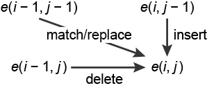

```python
#an algorithm for e(n, m):

for i in range(1, n+1):

    for j in range(1, m+1):

        e(i, j) = min(

                e(i-1, j-1) + diff(i, j),

                1 + e(i-1, j),

                e(i, j-1) + 1)
```

```python

#!/usr/bin/env python3

# Dynamic programming for Levenshtein edit distance.

# diff function
def diff(a,b):
    if a == b:
        return 0
    else:
        return 1

# Main algorithm
def editDistance(x,y):

    m = len(x)
    n = len(y)

    # Set up table, intially filled with zeros
    e = [[0 for i in range(m+1)] for j in range(n+1)]

    # Fill in table borders: these represent the simplest subproblems
    for i in range(0,n+1):
        e[i][0] = i
    for j in range(0,m+1):
        e[0][j] = j

    # Now apply dynamic programming algorithm!
    for i in range(1,n+1):
        for j in range(1,m+1):
            # match/replace, delete, insert
            e[i][j] = min(
                    e[i-1][j-1] + diff(x[j-1],y[i-1]),
                    1 + e[i-1][j],
                    1 + e[i][j-1])
    return e

# Helper function to display results
def printTable(table):
    for row in table:
        for item in row:
            print(str(item).ljust(2),end=' ')
        print()
    r = len(table)-1
    c = len(table[r])-1
    distance = str(table[r][c])
    print('Edit distance = ' + distance)
    print()

# Example pairs of words
str1 = 'TREES'
str2 = 'FOREST'

str3 = 'POLYNOMIAL' 
str4 = 'EXPONENTIAL'

str5 = 'KITTEN'
str6 = 'SITTING'

str7 = 'SIX'
str8 = 'ELEVEN'

e = editDistance(str1,str2)
print(str1,'to',str2)
printTable(e)

e = editDistance(str3,str4)
print(str3,'to',str4)
printTable(e)

e = editDistance(str5,str6)
print(str5,'to',str6)
printTable(e)

e = editDistance(str6,str5)
print(str6,'to',str5)
printTable(e)

e = editDistance(str7,str8)
print(str7,'to',str8)
printTable(e)
```
