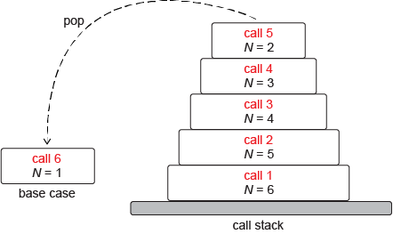

# Recursion and more

## Contents

1. [Introduction](#Introduction)

2. [Induction](#Induction)  

3. [Reduction](#Reduction)  

4. [Recursion](#Recursion)  

## Introduction

TODO - write intro

## Induction

The goal of mathematical proof is to establish a proposition to be certainly true, not just in individual cases, but in all cases to which the proposition applies

for example take the proposition that for the sum of _n_ numbers is:

``` python
S(n) = n(n+1)/2
```

To prove that a proposition _P_(_n_), where n is a natural number, holds for any natural number, inductive proofs always proceed in the same way, in two steps:

- The base case. Prove that _P_(1) is true.

- The inductive step. Assume that _P_(_k_) is true, where _k_ is some natural number (the inductive hypothesis), and then show that, given this, _P_(_k_ + 1) must be true as well.

Proof:

The base case. For n = 1, the proposition is obviously true, since by definition S(1) is the sum of the first one natural number, so S(1) is 1;

and when n = 1:

```tex
\frac{n(n+1)}{2} = \frac{1(1+1)}{2} = 1
```

Thus we see that

```tex
S(n) = \frac{n(n+1)}{2}
```

when _n_ = 1. In other words, we have established that _P_(1) is true.

The inductive step. Assume the inductive hypothesis is true – that _P_(_k_) is true for the natural number k, i.e. that the sum of the first _k_ natural numbers, _S_(_k_), is:

```tex
S(k) = \frac{k(k+1)}{2}
```

and then show that P(k + 1) is true; in other words we aim to show that:

```tex
S(k+1) = \frac{(k+1)((k+1)+1)}{2}

or

s(k+1) = \frac{(k+1)(k+2)}{2}
```

by definition  ```S(k+1)``` is the sum of the first ```k+1``` natural numbers. 

In other words:
```S(k+1) = 1 + 2 + ... + k + (k+1)```

the  inductive hypothesis is that

```tex
S(k) = \frac{k(k+1)}{2}
```

 . On this basis, from the line above we can deduce that:

 ``` tex
S(k+1) = \frac{k(k+1)}{2} + (k+1).

rearranging the right side

S(k+1) = \frac{k(k+1)}{2} + \frac{2(k+1)}{2}

then...

S(k+1) = \frac{(k+1)(k+2)}{2}
 ```

Two thing can be gleaned from this

- the proposition P(n) is true for n = 1
- if the proposition is true for k it is also true for k + 1

**Remeber To prove a proposition, firstly proved the simplest possible case of the proposition. Then we based the second part of our proof on increasing the size of the problem by 1.**

---

## Reduction

a reduction is a special kind of transformation: the problem becomes smaller at every stage, and each step moves towards a problem so trivial that it can be solved instantly.

---

## Recursion

Recursion is a computational technique that involves a function calling itself. It can be used in the algorithmic quest to break down a problem into smaller and smaller sub-problems.

A recursive algorithm must:

- Have a base case – usually a simple version of the problem that can be solved directly
- Involve a state-change that moves the problem stepwise towards the base case
- Call itself.

for example, the below function will sum up number in a list, by calling it's self to add each of the numbers

```python
def listSum(numList):
    if len(numList) == 1:
        return numList[0]
    else:
        return numList[0] + listSum(numList[1:])
```

In python, recursion takes advantage of stake frames

- A stack frame is a record of the local variables, along with their values, that a recursive function is using each time it calls itself.

- Each time round the recursive loop, a stack frame for that call is pushed on a special internal stack – the call stack – maintained by the Python interpreter. After the base case is reached, the stack frames are popped successively off the stack until the stack is empty.

- After the base case, the recursion unwinds – that is, all the stack frames are popped one by one.

- Each recursive call reduces the problem in some way.

- On each recursive call, the values of the function’s local variables are remembered – they are recorded in the stack frame; with iteration they are forgotten.

to further express this, consider factorials; a factorial of a positive integer _N_! is1 × 2 × 3 × ⋯ × (N − 1) × N. considering a basecase of 1! = 1, as in N is equal to 1 , then a recursive algorithm to solve N! would simply return N * function(N -1). expressed as plain english this would be ```If N is 1, the factorial of N is 1. Otherwise the factorial of N is N times the factorial of N − 1.```

which translated into python, would be

```python
def factorial(N):
    if N == 1:
        return 1
    else:
        return N * factorial(N-1)
```
Now let’s consider the state of the call stack at the moment at which the recursion hits the base case, assuming the function was initially called with N = 6.

On the sixth call, the base case has been reached, with the value of N = 1. From this point, the recursion unwinds. The top item on the stack (the base case) is popped, giving 1 as the value of factorial(1). (This situation is illustrated in Figure 3.10.) The next stack frame is then popped and 1 is multiplied by the value of N in this stack frame (2), giving factorial(2) = 1*2 = 2. The next stack frame is popped and the value of N found there (N = 3) is multiplied by the value of factorial( 2) we have already, giving factorial(3) = 6. The rest of the stack is progressively popped in this manner. By the time it is empty, the calculation 1 * 2 * 3 * 4 * 5 * 6 = factorial(6) = 720 has been performed.



A Second example of using a  recursive function is summation of n odd positive integers

Stated as a computational problem:

---

Name: OddIntegerSummation  
Inputs: An integer N  
Outputs: An integer F  
Precondition: N > 0  
Postcondition: S = 1 + 2 + 3 + ⋯ + 2N - 1

---

The basecase for this would be _N_ = 1

As structured english this would be:

```python
    IF N is equal to 1

        return 1

    ELSE

        return 2N - 1 + the sum of the first of N - 1 odd numbers
```

translated into python:

```python
def OddIntegerSummation(n):
    assert n > 0
    if(n == 1):
        return 1
    else:
        partialSum = sumOddNumbers(n - 1)
        return ((n * 2) - 1) + partialSum
```

Add details for recursice sorting....

It's possible to write both iterative and recursive versions of most algorithms, but it's not necessarily any faster, both versions of selection sort are still _O(n2)_
because they have one loop nested inside of another. In the recursive version the outerloop is recursive, and the inner loop is iterative. Whereas in the iterative version both loops are iterative. But it's still worth using recursion because:

- often it's easier to see algorithms in the recursive form (perhaps with more practice? - update this).
- Many problems are recursive in nature and lend themselves to such a solution
- recursive problems are often shorter, simpler and more elegant then the iterative versions
- However, deep recursions can weigh heavily on resources such as memory, due to the amount of stack frames created.

## Towers of Hanoi

The towers of hanoi is a prime example of where recursion can make solving a problem simpler and more straight forward than without. To solve this with recursion, n

```python
def move(x,y):
    print("Move {} to {}".format(x,y))


def towersOfHanoi(diskQty, fromPos, midPos, targetPos):
    if diskQty == 0:
        pass
    else:
        towersOfHanoi(diskQty-1,fromPos,targetPos,midPos)
        move(fromPos,targetPos)
        towersOfHanoi(diskQty-1,midPos,fromPos,targetPos)
```
