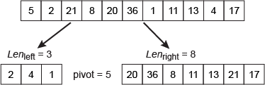
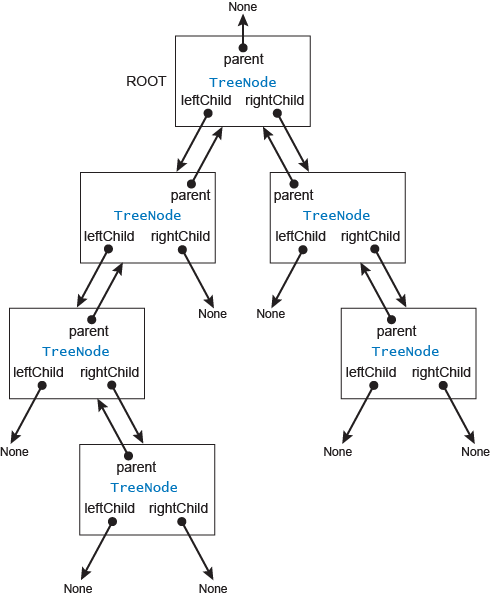
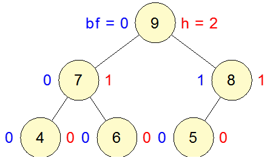

# Searching

## Contents

1. [Introduction](#Introduction)

2. [Searching for Patterns](#Searching-for-Patterns)  
    a. [Quick Search](#Quick-Search)  
    b. [Knuth–Morris–Pratt (KMP)](#Knuth–Morris–Pratt-(KMP))  
    c. [Boyer–Moore algorithm](#Boyer–Moore-algorithm)

3. [Hashing and hash tables](#Hashing-and-hash-tables)  
    a. [Collision resolution](#Collision-resolution)  
    b. [Analysis of hashing](#Analysis-of-hashing)
4. [Search Trees](#Search-trees)  
    a. [Binary Search Trees](#Binary-Search-Trees)  
    b. [AVL trees](#AVL-trees)

---

## Introduction

Searching is one of the most common operations in computing. In fact, solving most problems computationally can be seen as a form of search – looking for an answer amid a multitude of possibilities.

For instance finding the median in a list is a typical searching problem

What are the medians of [5, 7, 1, 6, 8, 22, 11, 34, 16, 4, 12] and of [6, 9, 2, 8, 17, 5, 31, 19, 3, 4, 15, 37]?

Sorting the lists we get:

[1, 4, 5, 6, 7, 8, 11, 12, 16, 22, 34] and

[2, 3, 4, 5, 6, 8, 9, 15, 17, 19, 31, 37].

therefore the median of the first list is 8 and the second list is 8.5 ((8+9)/2).

A median-finding problem is one instance of a more general problem of selection. Given an unordered list of n numbers, the selection task is to return the kth smallest item in the list. So, if k = 1 then we are looking for the smallest value in the list; k = 2 is the next smallest item after the minimum; and so on up to k = n, which is the maximum. So, the median-finding problem is just the selection problem with k = (n + 1)/2 if n is odd. (If n is even, then the median is the mean of the kth and (k +1)th smallest items, where k = n/2.)

Stated as a computational problem:

---

Name: Selection
Inputs: A sequence of integers S = (s1, s2, s3, …, sn), An integer k  
Outputs: An integer x  
Preconditions: Length of S > 0 and k > 0 and k ≤ n, For every sa, sb in S: if a ≠ b then sa ≠ sb  
Postcondition: x is the kth smallest item in S

---

a naive solution would be to sort the list (using quick sort) and then pick the kth smallest item, making the solution O(n log n). Alternatively, use a cut-down version of selection sort: find the smallest value and move it to the beginning of the list, then the next smallest, and go on doing this until the kth smallest item. But this has the same complexity as selection sort: it requires a nested loop, and so is O(n2)

  

Written as structured english:

```python
    IF length of S is 1

        return the first item in S

    set pivotValue to the first item in S

    set leftPart to an empty list

    set rightPart to an empty list

    ITERATE over S from the second item to the last item

        IF item is less than pivotValue

            append item to leftPart

        ELSE

            append item to rightPart

    IF length of leftPart greater than or equal to k

        return recursive call with (k, leftPart)

    ELSE IF length of leftPart equals k - 1

        return pivotValue

    ELSE

        return recursive call with (k - length of leftPart - 1, rightPart)
```

an example of quick search in python

```python
def quickSelect(k, aList):

    if len(aList) == 1:
        return aList[0]

    pivotValue = aList[0]
    leftPart = []
    rightPart = []

    for item in aList[1:]:
        if item < pivotValue:
             leftPart.append(item)
        else:
            rightPart.append(item)

    if len(leftPart) >= k:
        return quickSelect(k, leftPart)
    elif len(leftPart) == k - 1:
        return pivotValue
    else:
        return quickSelect(k - len(leftPart) -1, rightPart)
```

---

## Searching for Patterns

### Basic string search

A basic strategy to find a string within a sequence would be to start at the first character _S_ then compare the characters in the target string _T_ one be one until a match is found, if not the second character in _S_ is set as the start position and the check repeats.


A algorithm for this search would consist of:

- The outer loop will step over _S_ one position at a time using a variable searchIndex, say, to hold the position in _S_. It will terminate either when a match is found, or when searchIndex plus the length of _T_ becomes greater than the length of _S_.

- the inner loop steps over _T_ one position at a time using a variable targetIndex, say, to hold the position in _T_, comparing the current character in each string: that is, comparing the targetIndexth item in _T_ with the (searchIndex + targetIndex)th item in _S_. It terminates either when there is a mismatch, or when all characters in _T_ have been compared against the corresponding characters in _S_.

- If targetIndex is equal to the length of _T_ when the inner loop exits, then all characters of _T_ have been matched and the algorithm can return the current value of searchIndex as the location in _S_ at which _T_ has been found. If the outer loop exits with no match having been found, the algorithm returns −1 to indicate failure

written in structured english:

```python
set searchIndex to 0

ITERATE while searchIndex + length of T is less than or equal to length of S

    set targetIndex to 0

    ITERATE while targetIndex is less than length of T and
             item at targetIndex in T is equal to
             item at searchIndex + targetIndex in S

        set targetIndex to targetIndex + 1

    IF targetIndex is equal to length of T

        return searchIndex

    set searchIndex to searchIndex + 1

return -1
```

A python implementation:

```python
def basicStringSearch(searchString, target):
    searchIndex = 0
    while searchIndex + len(target) <= len(searchString):
        targetIndex = 0
        while (targetIndex < len(target)) and target[targetIndex] == searchString[targetIndex + searchIndex]:
            targetIndex = targetIndex + 1
        if targetIndex == len(target):
            return searchIndex
        searchIndex = searchIndex + 1
    return -1
```

As this is a brute force approach, it's not performant. Every possibility is tried until an occurrence of _T_ is found or _S_ is exhausted. The worst case is when the outer loop runs all the way to the end of S, and each execution of the inner loop runs all the way to the end of _T_. This will happen if on each comparison of _T_ against _S_ a mismatch doesn’t occur until the last character of _T_.

If that's the worst case then the the complexity of the basic string search algorithm for a target string _T_ of _m_ characters, and a search string _S_ of _n_ characters, since _T_ is only matched for the last position in _S_ and the last position in _T_ the algorithm will need to make _m_ comparisons on every execution of its inner loop. And it will have to do this all the way along _S_, from position _0_ to position _n − m_, i.e. there will be _n − m + 1_ executions of the inner loop. (This will also be true in the other worst case, where _T_ is not matched anywhere in _S_ at all.) Thus the total number of comparisons will be:

(n − m + 1) × m = mn − m2 + m.

Since _n > m_ (generally, _n_ is much larger than _m_), the term _mn_ quickly dominates, so the algorithm is _O(mn)_, which is hardly very efficient. In fact, since _n > m_, _O(mn) > O(m2)_. An algorithm with complexity _O(n)_ would be preferred, so that the running time mainly depends on the length of _S_ and is fairly insensitive to the length of _T_.

## Quick Search

Rather than checking each character in _S_ against _T_, a more performant approach is to for each character in _T_ calculate the number of positions to shift _T_ if a comparison fails, according to where (if at all) that character appears in _T_.

Repeatedly compare the characters of _T_ with those of _S_. If a comparison fails, examine the next character along in _S_ and shift _T_ by the calculated shift distance for that character.

Do this until an occurrence of _T_ in _S_ is found, or the end of _S_ is reached. The part of the algorithm calculating the shifts depends entirely on an analysis of the target string _T_ – there is no need to examine the search string _S_ at all because for any character in _S_ that is not in _T_, the shift is a fixed distance.

To begin with, build a DB of the characteristics of T. The DB is called a **shift table** and it stores a **shift distance** for each character in the alphabet.

The shift distance is calculated according to the following rules:

- If the character does not appear in _T_, the shift distance is one more than the length of _T_.
- If the character does appear in _T_, the shift distance is the first position at which it appears, counting from right to left and starting at 1.

For example, suppose the alphabet is {G, A, C, T} and the target string T is TCCACC. First, we number the characters of T from right to left starting at 1.

```json
TargetString:
TCCACC
654321
```

Now apply the rules above and draw up the shift table:

1. G does not appear in T, so the shift for G is one more than the length of T, i.e. 7.
2. A first occurs in T at position 3, so the shift for A is 3.
3. C first occurs in T at position 1, so the shift for C is 1.
4. T first occurs in T at position 6, so the shift for T is 6.

| G | A | C | T |
|:---:|:---:|:---:|:---:|
| 7 | 3 | 1 | 6 |

A shift table for the target string T = TGGCG would be:

| T | G | C |
|:---:|:---:|:---:|
| 5 | 1 | 2 |

Once the shift table has been computed, the search part of the quick search algorithm is similar to the basic string search algorithm, except that at the end of each failed attempt we look at the next character along in _S_ that is beyond _T_ and use this to look up in the shift table how many steps to slide _T_.


To create the **Shift table** the target string needs to be iterated and the shift indexes added to a collection that uses _key value pairs_ (ie a Dictionary) along with key, which in this case is the character.

This iteration and updating of shiftTable iin the structured English:

```python
ITERATE for each i between 0 and the length of target − 1

    set char to item at i in target

    set shift to length of target − i

    set the value of shiftTable entry with key char to shift

This translates straight into Python as follows:

for i in range(len(target)):

    char = target[i]

    shift = len(target) - i

    shiftTable[char] = shift
```

Even if a character appears more than once in the target string the shift table is updated to use the last occurrence, also as the values are checked from left to right, the final table with consist of the rightmost occurrences of the characters. If the character does not appear then they will have the default value of `len(target) + 1`, as the rules specify.

 Bringing together the modifications to the basic string search, the structured english for the quick search algorithm is:

 ```python

build shiftTable

set searchIndex to 0

ITERATE while searchIndex + length of T is less than or equal to length of S

    set targetIndex to 0

    ITERATE while targetIndex is less than length of T and
             item at targetIndex in T is equal to
             item at searchIndex + targetIndex in S

        set targetIndex to targetIndex + 1

    IF targetIndex is equal to length of T

        return searchIndex

    IF searchIndex + length of T is less than length of S

        set next to item at searchIndex + length of T in S

        set shift to value of key next in shiftTable

        set searchIndex to searchIndex + shift

    ELSE

        return –1

return –1
 ```

In python

```python
def buildShiftTable(target, alphabet):
    shiftTable = {}
    for character in alphabet:
        shiftTable[character] = len(target) + 1
    for i in range(len(target)):
        char = target[i]
        shift = len(target) - i
        shiftTable[char] = shift
    return shiftTable


def quickSearch (searchString, target, alphabet):
    shiftTable = buildShiftTable(target, alphabet)
    searchIndex = 0

    while searchIndex + len(target) <= len(searchString):
        targetIndex = 0
        while targetIndex < len(target) and target[targetIndex] == searchString[searchIndex + targetIndex]:
            targetIndex = targetIndex + 1
        if targetIndex == len(target):
            return searchIndex
        if searchIndex + len(target) < len(searchString):
            next = searchString[searchIndex + len(target)]
            shift = shiftTable[next]
            searchIndex = searchIndex + shift
        else:
            return -1
    return -1
```

## Knuth–Morris–Pratt (KMP)

In the KMP algorithm, for each character in the target string T we identify the longest substring of T ending with that character which matches a prefix of the target string. These lengths are stored in what is known as a prefix table (represented as a list in the examples below).

consider the target string _T_:

```GGATTGGATCACGG```

Starting with the first character of _T_, which is G, there are obviously no matching prefix substrings prior to it, because there is nothing prior to it. So our prefix table at this point is simply:

```[0]```

However, up to the second character of _T_, we have GG. The substring G of length 1 ending with the second character of _T_ matches the substring G at the start of _T_; that is, it matches the prefix G. Thus, we store 1 for this character and the prefix table is now:

```[0, 1]```

Moving on, up to the third character, A, we have GGA. There are no substrings matching a prefix here, so we enter 0 in the prefix table. Up to the fourth character we have GGAT. Again there are no matches. The same is true for the fifth character, so the prefix table so far looks like this:

```[0, 1, 0, 0, 0]```

However, things get a bit more interesting later in the target string.

Up to the sixth character we have GGATTG. The substring G at the start of _T_ matches the substring G ending with the sixth character. So the length 1 is stored in the prefix table.

Up to the seventh character we have GGATTGG. Using the same reasoning, GG at the start of _T_ matches the substring GG ending with the seventh character, so 2 is entered into the prefix table next.

Then up to the eighth character we have GGATTGGA. GGA at the start of _T_ matches the substring GGA ending with the eighth character and so the eighth entry in the prefix table will be 3, giving us a table up to this point of:

```[0, 1, 0, 0, 0, 1, 2, 3]```

The final table would look like

```[0, 1, 0, 0, 0, 1, 2, 3, 4, 0, 0, 0, 1, 2]```

the problem is to know if these prefix matches exist and – if they do – how long the matching substrings are. The KMP algorithm, therefore, is in two parts:

- Build a table of the lengths of prefix matches up to every character in the target string, _T_.
- Move along the search string, _S_, using the information in the table to do the shifting, as described above, and comparing in the usual fashion.

Once the prefix table has been built, the actual search in step 2 proceeds like the other string-searching algorithms we have looked at, but when a mismatch is detected the algorithm uses the prefix table to decide how to shift _T_. The prefix will then be aligned as shown below and comparison can continue at the next character in _S_.


What about the complexity of the KMP algorithm? Computing the prefix table takes significant effort but in fact there is an efficient algorithm for doing it. Overall, the KMP algorithm has complexity _O(m + n)_, where _m_ is the length of _T_ and _n_ is the length of _S_. Since _n_ is usually enormously larger than _m_ (think of searching a DNA string of billions of bases), _m_ is usually dominated by _n_, so this means that KMP has effective complexity _O(n)_.

A python implementation:

```python
def buildPrefixTable(target):
    prefixTable = [0] * len(target)
    q = 0
    for p in range(1, len(target)):
        while q > 0 and target[q] != target[p]:
            q = prefixTable[q - 1]
        if target[q] == target[p]:
            q = q + 1
        prefixTable[p] = q
    return prefixTable

def kmpSearch(searchString, target):
    n = len(searchString)
    m = len(target)
    prefixTable = buildPrefixTable(target)
    q = 0
    for i in range(n):
        while q > 0 and target[q] != searchString[i]:
            q = prefixTable[q - 1]
        if target[q] == searchString[i]:
            q = q + 1
        if q == m:
            return i - m + 1
    return -1
```

## Boyer–Moore algorithm

TODO - Research this and write notes

---

## Hashing and hash tables

A hash table is a collection of items which are stored in such a way as to make it easy to find them later. Each position of the hash table, often called a **slot**, can hold an item and is named by an integer value starting at 0. Initially the hash table contains no items so every slot is empty.

| 0 | 1 | 2 | 3 | 4 | 5 | 6 | 7 | 8 | 9 | 10 |
|:---:|:---:|:---:|:---:|:---:|:---:|:---:|:---:|:---:|:---:|:---:|
| null | null | null | null | null | null | null | null | null | null | null

The mapping between an item and the slot, where that item belongs in the has table is called a **hash function**. The has function will take any item in the collection and return an integer in the range of slot names, between _0_ & _m-1_. One method of determining the hash value is called the **remainder method**, which works by taking an item and dividing by the table size, returning the remainder as the hash value _(h(item) = item%11)_ (modulo arithmetic).

Taking a sample list of 56,26,93,17,77,31 and applying the remainder method, the hash values would be

| Item | Hash value |
|:---:|:---:|
54|10
26|4
93|5
17|6
77|0
31|9

Once the hash values have been computed each item can be inserted into the hash table at the designated position, shown in the table above. The amount of occupied slots is known as the **load factor** , denoted by _```λ = numberofitem/tablesize```_.

| 0 | 1 | 2 | 3 | 4 | 5 | 6 | 7 | 8 | 9 | 10 |
|:---:|:---:|:---:|:---:|:---:|:---:|:---:|:---:|:---:|:---:|:---:|
| 77 | null | null | null | 26 | 93 | 17 | null | null | 31 | 54 |

Now when searching for an item in the table, the hash function can be used to check if an item is present in the table. This operation is _O(1)_, since a constant amount of time is required to compute the hash value and then index the hash table at that location, assuming everything is where is should be this is a constant time search algorithm.

However a problem occurs when two or more items have the same hash value (44%11 == 0 & 77%11 == 0 ), this causes a **collision** or **clash**. (See [Collision resolution](#Collision-resolution))

Given a collection of items, a hash function that maps each item into a unique slot is referred to as a **perfect hash function**. If it's known that the items in the collection will not change then it's possible to construct a perfect hash function. However given an arbitrary collection of items there is no way to construct a perfect hash function, however to still gain performance efficiency the has function does not need to be perfect.

One way to achieve a perfect hash function is to increase the size of the hash table however this is only feasible with small numbers, a collection of 9 digit numbers for instance would almost 1 billion slots, potentially wasting huge amounts of memory. In order to create a hash function that minimises the number of collisions, is easy to compute and evenly distributes  the items, the remainder method needs to be extended.

the folding method is an extension of this, it begins by dividing the item into equal-sizes (the last item may be an exception). These pieces are then added together to give the resulting hash value. For instance take the number 436-555-4601, the digits would be divided into groups of 2 (43,65,55,46,01), then after the addition, we would get 210, then taking the 11 slot hash table above using the remainder method (_210 % 11 == 1_) the item would be placed into slot 1 of the hash table. Other folding methods go further and reverse every other piece of the item before the addition step, using the same number the reverse method would give (_43+56+55+64+01 = 219_), then applying the remainder method, (_219 % 11 = 10._)

Folding method in python

```python
def chopIntoPairs(aNumber):
    numString = str(aNumber)
    pairs = []
    for i in range( 0,len(numString), 2):
        pairs.append(int(numString[i: i + 2]))
    return pairs

def hashFold(num, tableSize):
    sum = 0
    splitNum = chopIntoPairs(num)
    for p in range(len(splitNum)):
        sum = sum + splitNum[p]

    return sum%tableSize
```

Another numerical technique for constructing a hash function is called the **mid-square method**. Which starts by squaring the item, then extracting some portion of the resulting value. Take 44 as an example, this would be squared to give 44<sub>2</sub> = 1936, then taking the middle two digits and performing the remainder step (_93%11 == 5_)

| Item | Remainder | Mid-square |
|:---:|:---:|:---:|
54|10| 3
26|4 | 7
93|5 | 9
17|6 | 8
77|0 | 4
31|9 | 6

Python example of mid-square

```python
def getMiddle(aNumber):
    numString = str(aNumber)
    midPoint = len(numString) // 2
    if (len(numString) % 2) == 0:
        middle = int(numString[midPoint - 1:midPoint + 1])
    else:
        middle = int(numString[midPoint])
    return middle

def hashMidSquare(num, tableSize):
    return (getMiddle((num*num))%tableSize)
```

Hash functions can also be used for character based items such as strings. Any string can be thought of as a sequence of ordinal values. Take the string "cat" this can be converted to ordinal values, which can be summed and then the remainder method used to get the hash value.

```python
def hash(str,tableSize):
    sum = 0
    for p in range(len(str)):
        sum = sum + ord(str[pos])
    return sum%tableSize
```

This method will return the hash value in the range of tablesize-1. However a collision issue arises when the string is an anagram, to get around this the position of the character in the string can be used as a weight.

```python
def weightedHash(str, tableSize):
    sum = 0
    for p in range(len(str)):
        sum = sum + (ord(str[pos])*str[pos])
    return sum%tableSize
```

Regardless of the hash function, whats important is that the function has to be efficient so that it does not become the dominant part of the storage and search process. If the hash function is too complex then it becomes more work to compute the slot name than it would be to do a basic sequential or binary search, defeating the point of hashing.

## Collision resolution

When two items hash to the same slot, a systematic way of placing the second item in the hash table needs to be in place, this is known as **collision resolution** , which becomes very important part of hashing.

A method for resolving collisions looks into the hash table and tries to find another open slot to hold the **clashed** item, simply by starting at the original hash value position and sequentially checking the slots until an empty one is encountered, going to the first slot may also be required to cover the entire hash table, this is referred to as **open addressing** in so far as it tries to find the next open slot or address. **Open addressing**, uses a technique called [Linear probing](https://en.wikipedia.org/wiki/Linear_probing).

Using open addressing to solve collisions means that the same method must be utilised to search for items as there could have been collisions means that the items have shifted in the hash table, therfore a sequential search must be done to determine if the item is present in any of the slots after the search index. Another disadvantage of **Linear probing** is the tendency for **clustering**, if too many collisions occur at the same hash value, a number of surrounding slots will be filled by the **linear probing** resolution, having an impact on the other items that are being inserted.

One way to deal with **clustering** is to extend the **linear probing** technique, so that instead of looking sequentially for the next open slot, slots are skipped, thereby more evenly distributing the items that have caused collisions, commonly called the **plus 3 probe** as 3 slots are skipped when placing the clashed value.

The general name for the process of looking for another slot after a collision is called **rehashing**, with simple linear probing the rehash function is ```newHashValue = rehash(oldHashValue)```, where ```rehash(pos) = (pos + 1)%sizeOfTable```. The plus 3 rehash can be defined as ```rehash(pos) = (pos + 3)%sizeOfTable```, more generally ```rehash(pos) = (pos + skip)%sizeOfTable```. It's important that the size of the skip be such that all slots in the table will be visited, otherwise part of the table will be unused. A useful method for this is to always use prime numbers (2, 3, 5, 7, 11, 13...)

A variation of the linear probing idea is called **quadratic probing**. Instead of using a constant skip value, a rehash function that increments the hash value by primes. this means that is the first has value is _h_ then successive values are _h+1, h+4, h+9, h+16_, essentially using a skip of successive perfect squares.

An alternate method for handling collisions is known as **Chaining**, this allows each slot to hold a reference to a collection (chain) of items. This allows many items to exist at the same location in the hash table and when a collision occurs the item is still places in the proper slot for the hash table, however as more items are added to the chain the difficulty of searching for the item increases. Since each slot holds a collection a searching technique needs to be used to determine if the item is present, the advantage being that there is likely to be fewer items in the chain.

## Analysis of hashing

In the best case hashing would provide a O(1) constant time search technique, however due to collisions and the number of comparisons this is typically not simple.

In general the most important piece of information needed to analyse the use of a hash table is the **load factor**, **λ**. Conceptually if λ is small, then there is a lower chance of collisions, meaning that the table is filling up, slots where they belong. If λ is large , meaning the table is filling up then there are more and more collisions. this means that collision resolution is more difficult, requiring more comparisons to find an empty slot. With chaining, increased collisions means an increased number of items on each chain.

Using **open addressing** with **linear probing** the average number of comparisons is approximately 1/2(1+1/1-λ) with an unsuccessful search giving 1/2(1+(1/1-λ)<sub>2</sub>). If chaining is used then the average is (1+ λ/2) for a successful case, is unsuccessful then λ comparisons.

## Search Trees

See [Trees and Heaps](./TreesandHeaps) for specific details on implementing basic trees and heaps. This section is only concerned with the specifics of Binary Search Trees and AVL trees

A search tree is a tree data structure used for locating specific keys from within a set. In order for a tree to function as a search tree, the key for each node must be greater than any keys in subtrees on the left, and less than any keys in subtrees on the right.

The advantage of search trees is that their efficient search time given the tree is reasonably balanced, which is to say the leaves at either end are of comparable depths. Various search-tree data structures exist, several of which also allow efficient insertion and deletion of elements, which operations then have to maintain tree balance.

Search trees are often used to implement an associative array. The search tree algorithm uses the key from the key-value pair to find a location, and then the application stores the entire key–value pair at that particular location.

### Binary Search Trees

Like a binary heap, a BST is a binary tree (every parent node has at most two children). However, the BST differs from the heap in two important ways:

- It need not be a complete tree.
- The BST ordering property is that for every node p, all the keys within p’s left subtree are  less than the key of p; and all the keys within p’s right subtree are greater than the key of p. In other words a Binary search tree is a binary tree in which a node has a value greater than all values in its left subtree and smaller than all values in its right subtree.

For example [10, 4, 32, 12, 9, 55, 92, 97, 36, 41, 34]  as a BST would look like:


Note that the ordering property is preserved: for any given node, all the nodes within its left subtree are all strictly smaller than that node, and all the nodes within its right subtree are greater than it. In general a node in a BST has not only a key but also a value associated with it, sometimes known as the **payload**. Items are stored in, and retrieved from, a BST through their keys.


Efficiently searching a BST is similar to the way a binary search works, in so far as in binary search of a list, we split the list into left and right partitions, and then search either the left or the right partition, according to the search value. In a binary search tree, we search the left or the right subtree of a node, according to the key we are searching for. This efficiency takes advantage of the ordering rule, an algorithm written in structured english for this would look like:

```python
set current node to the root

set found to False

set done to False

ITERATE while done is False and found is False

    IF the search key is the key of the current node

        set found to True

    ELSE

        IF the search key is less than the key of the current node

            IF there is a left child

                set current node to the left child

            ELSE

                set done to True

        ELSE

            IF there is a right child

                set current node to the right child

            ELSE

                set done to True

return found
```

A binary search tree is just a collection of appropriately connected **TreeNodes**, with one of these especially designated as the root as below:


### Inserting a node

Inserting a node into a binary tree is a relatively simple operation, because all we are concerned with is preserving the ordering of the tree. Where a new node will go in the BST of course depends on its key and on the state of the tree before the addition. suppose we are trying to insert a node N with key k into the tree. First of all, there are two main cases to consider:

- The tree is empty. In this case, N simply becomes the root.
- The tree already contains nodes. In this case, we have to make sure we observe the ordering property of the tree in finding the right place to insert the new node. We start by setting the current node to the root.

Now if we home in on case 2, we can see that there are two possibilities:

- If k is less than the key of the current node, then we need to find a place for N in the left subtree of the current node.
- If k is greater than the key of the current node, then we need to find a place for N in the right subtree of the current node.

In both these cases, there are two possibilities, applying equally to left or right subtrees:

- If the subtree is empty, i.e. if leftChild (or rightChild) is None then N becomes the left (or right) child of the current node.
 -If the subtree is not empty, then set the current node to be the left (or right) child of the current node and start again at step 3.

In other words, start at the root and then descend the tree, branching left or right depending on the value of k, until a spot can be found to insert N.

Integrating a new node into the tree is a matter of creating a new node, setting its key and payload, and then making sure the child and pointer references are set up. For instance, one such situation is illustrated below:


This written as structured english

```python
IF root is None

    set the root to N

ELSE

    set current to the root

The second part of the insight can be represented as:

IF k is less than the key of current

    IF leftChild of current is None

        set N to be the leftChild of current

        set current to be the parent of N

    ELSE

        set current to the leftChild of current

        insert N into the tree rooted at current *

ELSE

    IF rightChild of current is None

        set N to the rightChild of current

        set current to be the parent of N

    ELSE

        set current to the rightChild of current

        insert N into the tree rooted at current *

Note that the two lines marked with a * are recursive calls.
```

### Deleting a node

Deleting a node in a BST is a rather more complex process than insertion. Once again, the change must preserve the tree’s ordering property, but the fact that the node we are trying to delete may have children which are not to be deleted could cause complications.

Removing a node from a BST will also require some manipulation of parent and child pointers. For instance, the image below represents a situation in which a node with no children is deleted. The child pointer of the deleted node’s parent has to be adjusted to None.


below shows a node with one child being deleted. The parent pointer of N’s child is set to N’s parent. And N’s parent’s leftChild pointer is set to N’s child


Written in structured english

```python
IF N has no children

    delete it and set its parent’s child pointer to None

IF N has one child

    IF N is a left child

        make N’s child the left child of N’s parent

    IF N is a right child

        make N’s child the right child of N’s parent

IF N has two children

    find N’s successor

    overwrite N’s data with that of N’s successor

    delete N’s successor
```

### Complexity of BST

The height of the BST may be highly variable, depending on the order in which the items were inserted into it. If n keys are inserted in random order, then the tree should be roughly balanced and the worst-case performance for locating an item will be O(log n). However, if n keys are inserted in sorted order then the BST will be of height n − 1 and worst-case retrieval will be O(n).

It can be shown that exactly the same is true for the insert and delete operations. So we know the best- and worst-case performances.

However, it is unlikely that we are going to get a perfectly balanced tree or a perfectly unbalanced tree. So what can we say about average-case performance of the BST operations on a BST formed by random insertions? It can be proved that the performance in this case is also O(log n)

### AVL Trees

AVL trees are named for it's inventors G.M Adelson-velskii and EM Landis and builds upon the principles of a BST.

The main points that differentiate the difference between an BST and AVL tree are below:

- A balanced BST is a BST with an additional constraint that the difference in height between any node’s left and right subtree must never exceed 1. Each node has an associated balance factor, which is calculated by subtracting the height of the node’s right subtree from the height of its left subtree. So a BST is unbalanced if any node in it has a balance factor not equal to −1, 0 or 1.
- A special type of BST, the AVL tree, is always balanced (each node has a balance factor of −1, 0 or 1). If an AVL tree becomes unbalanced it has to be automatically rebalanced.
- A subtree is left-heavy if the balance factor of its root node is greater than zero. It is right-heavy if this balance factor is less than zero.
- A mathematical proof exists that the height h of an AVL tree will never be more than about 1.44 _log Nh_, where _Nh_ is the number of nodes in the tree. [AVL tree performance](#AVL-tree-performance)

The following diagram shows the balance factor of each node and the height of each sub-tree.



 each node is annotated with its balancing factor and the height of the tree rooted at that node. The root 9 is annotated with balance factor 0 and height 2. At the next level, left child 7 is annotated with balance factor 0 and height 1, and right child 8 is annotated with balance factor 1 and height 1. At the lowest level are the leaves 4, 6 and 5, all with balance factor and height zero.

Node 4 has 2 edges to the root, so has level 2. Node 4 is one of the deepest in the tree, so the tree’s height is also 2. Node 7 has both subtrees of the same height, so it has balance factor 0. Node 8 has balance factor 1, all others have 0, so the tree is balanced. The tree is a max heap: it’s complete and each child is smaller than its parent. The right child of 7 is smaller than 7, so it isn't a BST.

The formula for this calculation is _balanceFactor = height(leftSubTree) - height(rightSubTree)_

### AVL tree performance

By ensuring that a tree always has a balance factor of -1,0,1 better Big-O performance of key operations is achieved.

There are two possibilities to consider, a left heavy tree and a right heavy tree, taking tree heights of 0,1,2,3


For a tree of height 0, there is 1 node, for a tree of height 1 there is 1 + 1 = 2 nodes, for a tree of height 2 there is 1 + 1 + 2 = 4 nodes, and for a tree of height 3 there are 1 + 2 + 4 = 7. In general the pattern for the number of nodes in a tree of height _h (N<sub>h</sub>)_ is:

_N<sub>h</sub> = 1 + N<sub>h -1 </sub> + N<sub>h -2 </sub>_

This is very similar to the Fibonacci sequence, this can be used to derive a formula for the height of an AVL tree given the number of nodes in a tree.
