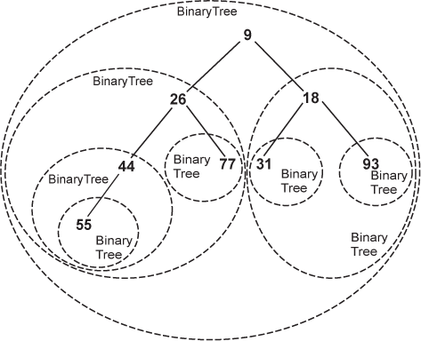

# Trees And Heaps

## Contents

1. [Trees](#Trees)  
    a. [Traversing a tree](#Traversing-a-tree)  
    b. [Binary Trees](#Binary-Trees)  
2. [Heaps](#Heaps)

---

## Trees

### Important points

- Hierarchical
- Children of one tree node are independent of the children of another
- Leaf nodes are unique.

**Key terms:**

**Node** - Fundamental part, which has a name (key). May also contain additional information (payload)

**Edge** - This connects two Nodes to show there is a clear relationship between them. every Node, but the root is connected by exactly one incoming edge from another node. Each node  may have several outgoing edges.

**Root** - The root of the tree is the only node in the tree tht has no incoming edges.

**Path** - An ordered list of nodes that are connected by Edges.

**Children** - The set of nodes, that have incoming edges from the same node.

**Parent** - A node is the parent of all the nodes it connects ti with outgoing edges

**Sibling** - Nodes in the tree that are children of the same parent.

**Subtree** - A set of nodes and edges comprised of a parent and all the descendants of thst point

**Leaf Node** - A node that has no children

**Level** - The level of a node _n_ is the number of edges on the path from the root node to _n_

**Height** - Height is equal to the maximum level of any node in the tree

There are two definitions for a Tree

***First Definition***

A tree consists of a set of nodes and a set of edges that connect pairs of nodes. A tree has the following properties:

- One node of the tree is designated as the root node
- Every node _n_, except the root node, is connected bu an edge from exactly one other node _p_, where _p_ is the parent of _n_
- a unique path traverses from the root to each node
- If each node in the tree has a maximum of two children, the tree is a binary tree.

***Second Definition***

A tree is either empty or consists of a root and zero or more subtrees, each of which is also a tre. The root of each subtree is connected to the root of the parent tree. this is the recurisve definition

### Traversing a tree

- Traversing a tree simply means visiting every node in it.

- Three ways of traversing a tree are presented: preorder, postorder and inorder.

### Binary Trees

A binary tree is defined as a tree in which each node has a maximum of two children. and a binary tree, each child of a node is designated as the left or right child

- A complete binary tree is a binary tree in which all parents have two children, except for the parents of children at the bottom level of the tree. At the bottom level, all nodes must be as far to the left as possible.

## Heaps
